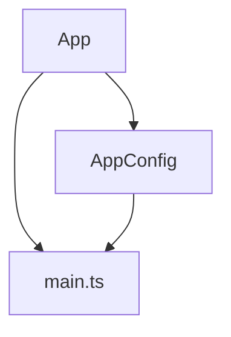
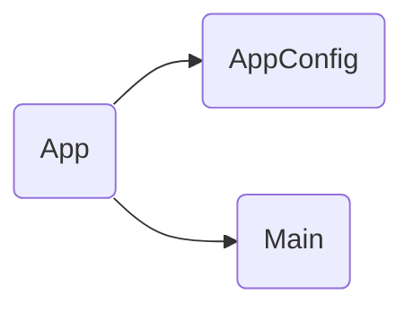

# Docs Generator — Zettelkasten + Graph Theory + QMD

Este skill genera documentación siguiendo los principios de:

1. **Zettelkasten** — Notas atómicas con ID único, enlaces bidireccionales y metadatos
2. **Teoría de Grafos** — Componentes como nodos, dependencias como aristas, visualización Mermaid
3. **QMD** — Frontmatter YAML para indexación y búsqueda semántica

Se ejecuta **automáticamente en cada pre-commit** vía `scripts/pre-commit.ps1`.

---

## Zettelkasten para código

### ID de notas
Cada documento recibe un ID único secuencial según su tipo:

| Prefijo | Tipo | Ejemplo |
|---------|------|---------|
| `comp-` | Componente | `comp-001` |
| `serv-` | Servicio | `serv-001` |
| `dir-` | Directiva | `dir-001` |
| `pipe-` | Pipe | `pipe-001` |
| `guard-` | Guard | `guard-001` |
| `cfg-` | Configuración | `cfg-001` |
| `entry-` | Entry point | `entry-001` |
| `idx-` | Índice / Hub | `idx-001` |

Los IDs se almacenan en `docs/.zk-ids.json` y se incrementan automáticamente.

### Frontmatter completo
```yaml
---
zk_id: comp-001
title: App
description: Componente raíz de la aplicación
type: component
tags: [angular, component, root, layout]
author: lanca
created: 2025-06-05
updated: 2025-06-05
path: src/app/app.ts
collection: poc-admin-migala
---
```

### Enlaces Zettelkasten
Usa `[[zk_id]]` para enlazar notas relacionadas:
- Dependencias importadas: `[[comp-002]]`
- Dependientes: `[[comp-003]]`
- Relacionados: `[[serv-001]]`

Cada nota incluye una sección **Zettelkasten** con:
```markdown
## Zettelkasten

| Campo | Valor |
|-------|-------|
| ID | `comp-001` |
| Autor | @usuario |
| Creado | 2025-06-05 |
| Tags | angular, component, root |

### Enlaces salientes (dependencias)
- [[entry-001]] → main.ts lo bootstrapa
- [[cfg-001]] → usa app.config

### Enlaces entrantes (dependientes)
Ninguno (es el nodo raíz)
```

---

## Teoría de Grafos

Cada componente es un **nodo** en el grafo de la aplicación. Las importaciones/inyecciones son **aristas dirigidas**.

### Métricas por nodo
- **Fan-in** (grado de entrada): cuántos componentes dependen de este
- **Fan-out** (grado de salida): de cuántos componentes depende este
- **Centralidad**: qué tan conectado está en el grafo

### Visualización
Se genera un grafo Mermaid en `docs/GRAPH.md`:



Cada nota incluye:
```markdown
## Grafo de dependencias



| Métrica | Valor |
|---------|-------|
| Fan-out | 2 (AppConfig, Main) |
| Fan-in | 0 (nodo raíz) |
```

### Grafo global
`docs/GRAPH.md` contiene el grafo completo de la aplicación con todos los nodos y aristas.

---

## Autoría

El autor se extrae de `git config user.name` (o variable de entorno `ZK_AUTHOR`).

Cada commit actualiza:
- `updated` en el frontmatter
- El changelog de la nota (sección Cambios recientes)
- El grafo global si las dependencias cambiaron

---

## Pre-commit hook

El hook `scripts/pre-commit.ps1` se ejecuta automáticamente antes de cada commit y:

1. Detecta archivos `.ts` modificados en el staging
2. Re-genera docs solo para esos archivos (o todos si hay cambios estructurales)
3. Actualiza IDs Zettelkasten y grafos
4. Agrega los docs modificados al commit
5. Falla el commit si hay errores de documentación

Instalación:
```powershell
# Una vez:
.\scripts\install-hooks.ps1
```

---

## Estructura de salida

```
docs/
├── .zk-ids.json              # Contador de IDs Zettelkasten
├── INDEX.md                  # Nota hub con índice de todos los documentos
├── GRAPH.md                  # Grafo global de dependencias (Mermaid)
├── qmd-index.yml             # Configuración de colección QMD
├── main.md                   # entry-001
├── app.config.md             # cfg-001
├── app.routes.md             # cfg-002
├── components/
│   └── app.component.md      # comp-001
├── services/
├── directives/
├── pipes/
├── guards/
└── graphs/                   # Imágenes de grafos (opcional)
```

---

## Flujo completo

1. Hook detecta archivos cambiados → obtiene autor del git config
2. Para cada `.ts` modificado: extrae imports, decoradores, inputs/outputs
3. Genera/actualiza nota markdown con frontmatter + enlaces ZK
4. Construye matriz de adjacencia del grafo de dependencias
5. Genera `docs/GRAPH.md` con Mermaid
6. Actualiza `docs/INDEX.md` con el hub
7. `git add docs/` para incluir en el commit
8. Si `qmd` está instalado, opcionalmente reindexa
