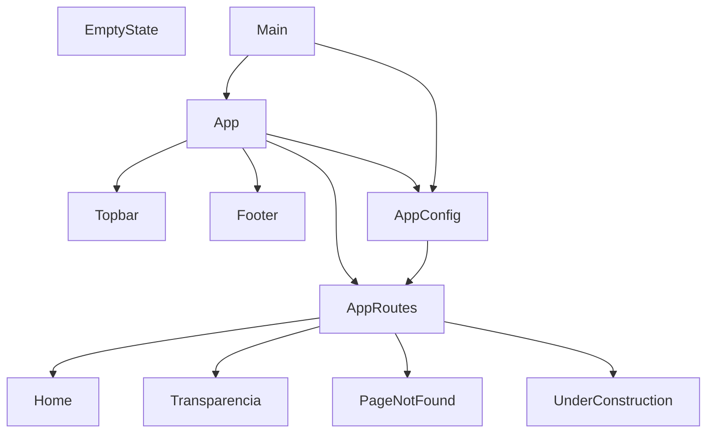

# Grafo de dependencias — POC_admin_migala

Generado automáticamente el 2025-06-05 por @lanca.

## Grafo Mermaid

## Nodos

| ID | Nombre | Tipo | Fan-in | Fan-out |
|----|--------|------|--------|---------|
| comp-001 | App | component | 1 | 4 |
| comp-002 | Topbar | component | 1 | 0 |
| comp-003 | Footer | component | 1 | 0 |
| comp-004 | Home | component | 1 | 0 |
| comp-005 | Transparencia | component | 1 | 0 |
| comp-006 | PageNotFound | component | 1 | 0 |
| comp-007 | EmptyState | component | 0 | 0 |
| comp-008 | UnderConstruction | component | 1 | 0 |
| cfg-001 | AppConfig | config | 2 | 1 |
| cfg-002 | AppRoutes | config | 2 | 4 |
| entry-001 | Main | entry | 0 | 2 |

## Aristas

| Origen | Destino | Tipo |
|--------|---------|------|
| comp-001 | comp-002 | import |
| comp-001 | comp-003 | import |
| comp-001 | cfg-001 | import |
| comp-001 | cfg-002 | import |
| cfg-001 | cfg-002 | import |
| cfg-002 | comp-004 | route |
| cfg-002 | comp-005 | route |
| cfg-002 | comp-006 | route |
| cfg-002 | comp-008 | route |
| entry-001 | comp-001 | import |
| entry-001 | cfg-001 | import |
