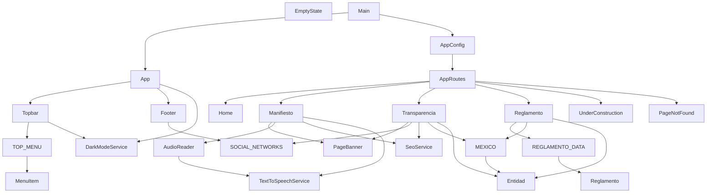

# Grafo de dependencias — POC_admin_migala

Generado automáticamente el 2026-06-10 por @lancast.

## Grafo Mermaid

## Nodos

| ID | Nombre | Tipo | Fan-in | Fan-out |
|----|--------|------|--------|---------|
| comp-001 | App | component | 1 | 3 |
| comp-002 | Topbar | component | 1 | 2 |
| comp-003 | Footer | component | 1 | 1 |
| comp-004 | Home | component | 1 | 0 |
| comp-005 | Transparencia | component | 1 | 5 |
| comp-006 | PageNotFound | component | 1 | 0 |
| comp-007 | EmptyState | component | 0 | 0 |
| comp-008 | UnderConstruction | component | 1 | 0 |
| comp-009 | Reglamento | component | 1 | 3 |
| comp-010 | PageBanner | component | 2 | 0 |
| comp-011 | Manifiesto | component | 1 | 4 |
| comp-012 | AudioReader | component | 1 | 1 |
| serv-001 | SeoService | service | 2 | 0 |
| serv-002 | DarkModeService | service | 2 | 0 |
| serv-003 | TextToSpeechService | service | 2 | 0 |
| model-001 | Entidad | model | 3 | 0 |
| model-002 | Reglamento | model | 1 | 0 |
| data-001 | MEXICO | data | 2 | 1 |
| data-002 | REGLAMENTO_DATA | data | 1 | 1 |
| data-003 | SOCIAL_NETWORKS | data | 2 | 0 |
| data-004 | TOP_MENU | data | 1 | 1 |
| data-005 | MenuItem | data | 1 | 0 |
| cfg-001 | AppConfig | config | 2 | 1 |
| cfg-002 | AppRoutes | config | 2 | 6 |
| entry-001 | Main | entry | 0 | 2 |

## Aristas

| Origen | Destino | Tipo |
|--------|---------|------|
| comp-001 | comp-002 | import |
| comp-001 | comp-003 | import |
| comp-001 | serv-002 | import |
| comp-002 | data-004 | import |
| comp-002 | serv-002 | import |
| comp-003 | data-003 | import |
| comp-005 | comp-010 | import |
| comp-005 | data-003 | import |
| comp-005 | serv-001 | import |
| comp-005 | data-001 | import |
| comp-005 | model-001 | import |
| comp-009 | data-002 | import |
| comp-009 | data-001 | import |
| comp-009 | model-001 | import |
| comp-011 | comp-010 | import |
| comp-011 | comp-012 | import |
| comp-011 | serv-001 | import |
| comp-011 | serv-003 | import |
| comp-012 | serv-003 | import |
| cfg-001 | cfg-002 | import |
| cfg-002 | comp-004 | route |
| cfg-002 | comp-011 | route |
| cfg-002 | comp-005 | route |
| cfg-002 | comp-009 | route (lazy) |
| cfg-002 | comp-008 | route |
| cfg-002 | comp-006 | route |
| entry-001 | comp-001 | import |
| entry-001 | cfg-001 | import |
| data-001 | model-001 | import |
| data-002 | model-002 | import |
| data-004 | data-005 | import |
