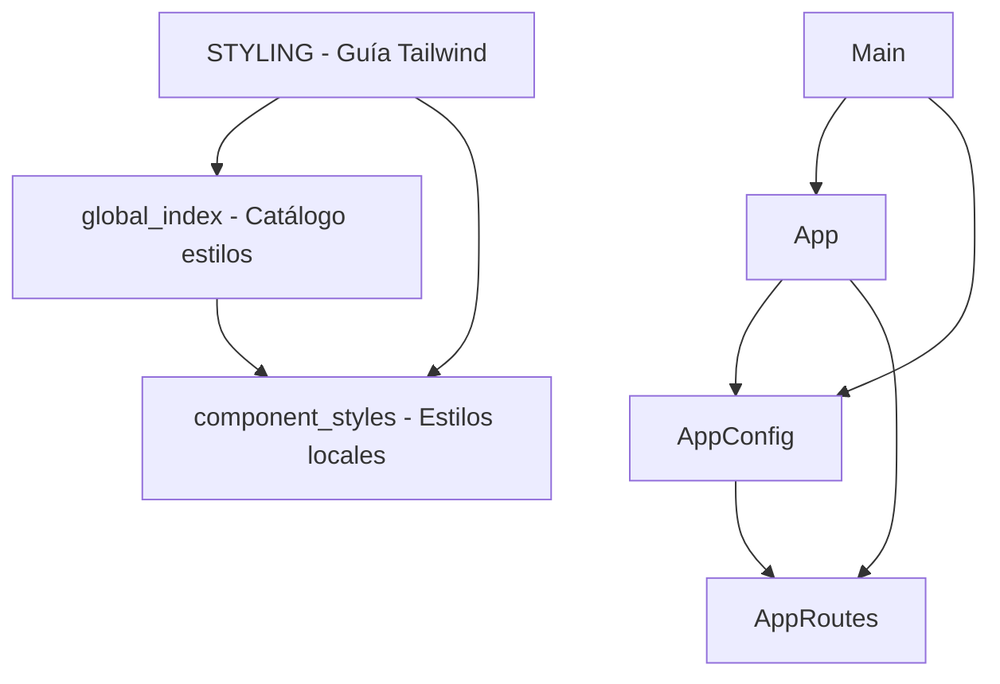

# Grafo de dependencias — POC_admin_migala

Generado automáticamente el 2025-06-05 por @lanca.

## Grafo Mermaid

## Nodos

| ID | Nombre | Tipo | Fan-in | Fan-out |
|----|--------|------|--------|---------|
| comp-001 | App | component | 1 | 2 |
| cfg-001 | AppConfig | config | 2 | 1 |
| cfg-002 | AppRoutes | config | 1 | 0 |
| entry-001 | Main | entry | 0 | 2 |
| docs-001 | STYLING.md | docs | 0 | 2 |
| docs-002 | global_index.md | docs | 1 | 1 |
| docs-003 | component_styles.md | docs | 2 | 0 |

## Aristas

| Origen | Destino | Tipo |
|--------|---------|------|
| comp-001 | cfg-001 | import |
| comp-001 | cfg-002 | import |
| cfg-001 | cfg-002 | import |
| entry-001 | comp-001 | import |
| entry-001 | cfg-001 | import |
| docs-001 | docs-002 | referencia |
| docs-001 | docs-003 | referencia |
| docs-002 | docs-003 | referencia |
