# Grafo de dependencias — POC_admin_migala

Generado el 2026-06-15 a partir de cabeceras Zettelkasten en los 43 archivos `.ts` fuente.

## Leyenda

| Símbolo | Tipo | Color Mermaid |
|---------|------|---------------|
| `data-*` | Datos/constantes | `#10b981` (verde) |
| `model-*` | Modelos/Interfaces | `#f59e0b` (ámbar) |
| `svc-*` | Servicios | `#3b82f6` (azul) |
| `ui-*` | Componentes UI | `#8b5cf6` (violeta) |
| `page-*` | Páginas | `#ef4444` (rojo) |
| `root-*` | Raíz/Entry | `#ec4899` (rosa) |
| `cfg-*` | Configuración | `#06b6d4` (cian) |

## Grafo Mermaid

```mermaid
graph TD
  %% ─── classDefs ────────────────────────────────────────────────
  classDef data fill:#065f46,stroke:#10b981,color:#fff
  classDef model fill:#92400e,stroke:#f59e0b,color:#fff
  classDef service fill:#1e3a5f,stroke:#3b82f6,color:#fff
  classDef ui fill:#4c1d95,stroke:#8b5cf6,color:#fff
  classDef page fill:#7f1d1d,stroke:#ef4444,color:#fff
  classDef root fill:#831843,stroke:#ec4899,color:#fff
  classDef config fill:#164e63,stroke:#06b6d4,color:#fff

  %% ─── DATA (12) ────────────────────────────────────────────────
  subgraph DATA["📦 data — Datos y constantes"]
    data-001["MEXICO<br/>32 estados + municipios"]
    data-002["REGLAMENTO_DATA<br/>Reglamento Nacional completo"]
    data-003["SOCIAL_NETWORKS<br/>Redes sociales oficiales"]
    data-004["TOP_MENU<br/>Elementos del menú"]
    data-006["TELEGRAM_LINKS<br/>Fuente única Telegram URLs"]
    data-007["ORGANIGRAMA_NACIONAL<br/>Árbol jerárquico canónico"]
    data-008["ORGANIZACIONES_DATA<br/>Catálogo de organizaciones"]
    data-009["ARCHIVOS_DATA<br/>Catálogo de documentos"]
    data-010["PROCEDIMIENTOS_DATA<br/>Guías y trámites formales"]
    data-011["RUTA_CRITICA_DATA<br/>Plan Nacional de Trabajo 2026"]
    data-012["REGLAMENTO_ESTATAL_DATA<br/>Catálogo reglamentos estatales"]
  end

  %% ─── MODELS (9) ───────────────────────────────────────────────
  subgraph MODELS["📐 model — Interfaces y tipos"]
    model-001["ENTIDAD<br/>País, Estado, Municipio"]
    model-002["REGLAMENTO<br/>Reglamento Nacional"]
    model-003["ORGANIZACION<br/>Órganos de trabajo"]
    model-004["ARCHIVO<br/>Documentos del archivo"]
    model-005["PROCEDIMIENTO<br/>Trámites administrativos"]
    model-006["RUTA_CRITICA<br/>Objetivos estratégicos"]
    model-007["REGLAMENTO_TRAZABLE<br/>Trazabilidad y gobernanza"]
    model-008["USUARIO<br/>Perfil de miembro"]
    model-009["MENU_ITEM<br/>Elemento del menú"]
  end

  %% ─── SERVICES (4) ─────────────────────────────────────────────
  subgraph SERVICES["⚙️ svc — Servicios"]
    svc-001["DARK_MODE_SERVICE<br/>Modo oscuro con persistencia"]
    svc-002["TEXT_TO_SPEECH_SERVICE<br/>Síntesis de voz Web Speech API"]
    svc-003["REGLAMENTO_SERVICE<br/>Lógica de negocio del Reglamento"]
    svc-004["SEO_SERVICE<br/>Meta tags y SEO"]
  end

  %% ─── UI COMPONENTS (7) ────────────────────────────────────────
  subgraph UI["🧩 ui — Componentes de UI"]
    ui-001["TOPBAR<br/>Barra de navegación principal"]
    ui-003["FOOTER<br/>Pie de página institucional"]
    ui-004["PAGE_BANNER<br/>Banner decorativo de cabecera"]
    ui-005["PAGE_NOT_FOUND<br/>Error 404"]
    ui-006["UNDER_CONSTRUCTION<br/>Sección en desarrollo"]
    ui-007["EMPTY_STATE<br/>Estado vacío para listas"]
    ui-008["AUDIO_READER<br/>Reproductor de texto-a-voz"]
  end

  %% ─── PAGES (7) ────────────────────────────────────────────────
  subgraph PAGES["📄 page — Páginas de la aplicación"]
    page-001["HOME<br/>Inicio / landing"]
    page-002["MANIFIESTO<br/>Manifiesto del proyecto"]
    page-003["PROPUESTA<br/>Propuesta política"]
    page-004["REGLAMENTO<br/>Reglamento interactivo"]
    page-005["ARCHIVO<br/>Archivo + Organigrama + Directorio"]
    page-006["ESTRUCTURA<br/>Explorador organizacional"]
    page-007["TRANSPARENCIA<br/>Portal de transparencia"]
  end

  %% ─── ROOT (4) ─────────────────────────────────────────────────
  subgraph ROOT["🏗️ root — Punto de entrada"]
    root-001["APP<br/>Componente raíz"]
    root-002["APP_CONFIG<br/>Configuración global"]
    root-003["APP_ROUTES<br/>Definición de rutas"]
    root-004["MAIN<br/>Entry point (bootstrap)"]
  end

  %% ─── CONFIG (1) ───────────────────────────────────────────────
  subgraph CONFIG["⚙️ cfg — Configuración"]
    cfg-003["REGLAMENTO_CONSTANTS<br/>Constantes visuales de reglamentos"]
  end

  %% ═══════════════════════════════════════════════════════════════
  %%  ARISTAS — Entry → Root
  %% ═══════════════════════════════════════════════════════════════
  root-004 --> root-001
  root-004 --> root-002
  root-002 --> root-003

  %% ═══════════════════════════════════════════════════════════════
  %%  ARISTAS — Root → Componentes
  %% ═══════════════════════════════════════════════════════════════
  root-001 --> ui-001
  root-001 --> ui-003
  root-001 --> svc-001

  root-003 --> page-001
  root-003 --> page-002
  root-003 --> page-003
  root-003 --> page-004
  root-003 --> page-005
  root-003 --> page-006
  root-003 --> page-007
  root-003 --> ui-006
  root-003 --> ui-005

  %% ═══════════════════════════════════════════════════════════════
  %%  ARISTAS — Páginas → dependencias
  %% ═══════════════════════════════════════════════════════════════
  page-001 --> ui-004
  page-001 --> svc-004

  page-002 --> ui-004
  page-002 --> ui-008
  page-002 --> svc-002
  page-002 --> svc-004

  page-003 --> ui-004
  page-003 --> svc-004

  page-004 --> svc-003
  page-004 --> data-001
  page-004 --> cfg-003
  page-004 --> model-001
  page-004 --> model-002

  page-005 --> ui-004
  page-005 --> svc-004
  page-005 --> data-001
  page-005 --> data-003
  page-005 --> data-006
  page-005 --> data-008
  page-005 --> data-009
  page-005 --> data-011
  page-005 --> model-001
  page-005 --> model-003
  page-005 --> model-004

  page-006 --> data-008
  page-006 --> data-010
  page-006 --> model-003
  page-006 --> model-005

  page-007 --> ui-004
  page-007 --> svc-004
  page-007 --> data-001
  page-007 --> data-003
  page-007 --> model-001

  %% ═══════════════════════════════════════════════════════════════
  %%  ARISTAS — Componentes → dependencias
  %% ═══════════════════════════════════════════════════════════════
  ui-001 --> data-004
  ui-001 --> svc-001

  ui-003 --> data-003

  ui-008 --> svc-002

  %% ═══════════════════════════════════════════════════════════════
  %%  ARISTAS — Servicios → dependencias
  %% ═══════════════════════════════════════════════════════════════
  svc-003 --> data-002
  svc-003 --> data-012

  %% ═══════════════════════════════════════════════════════════════
  %%  ARISTAS — Data → Model / Data → Data
  %% ═══════════════════════════════════════════════════════════════
  data-001 --> model-001
  data-002 --> model-002
  data-004 --> model-009
  data-006 --> data-007
  data-006 --> data-008
  data-008 --> model-003
  data-009 --> model-004
  data-010 --> model-005
  data-011 --> model-006
  data-012 --> data-001
  data-012 --> model-001
  data-012 --> model-007

  %% ═══════════════════════════════════════════════════════════════
  %%  ARISTAS — Config → dependencias
  %% ═══════════════════════════════════════════════════════════════
  cfg-003 --> model-007

  %% ─── Apply styles ─────────────────────────────────────────────
  class data-001,data-002,data-003,data-004,data-006,data-007,data-008,data-009,data-010,data-011,data-012 data
  class model-001,model-002,model-003,model-004,model-005,model-006,model-007,model-008,model-009 model
  class svc-001,svc-002,svc-003,svc-004 service
  class ui-001,ui-003,ui-004,ui-005,ui-006,ui-007,ui-008 ui
  class page-001,page-002,page-003,page-004,page-005,page-006,page-007 page
  class root-001,root-002,root-003,root-004 root
  class cfg-003 config
```

## Nodos

| ID | Nombre | Tipo | Archivo |
|----|--------|------|---------|
| `data-001` | MEXICO — 32 estados + municipios | `data` | `core/data/entidades.data.ts` |
| `data-002` | REGLAMENTO_DATA — Reglamento Nacional completo | `data` | `core/data/reglamento.data.ts` |
| `data-003` | SOCIAL_NETWORKS — Redes sociales oficiales | `data` | `core/social-networks.ts` |
| `data-004` | TOP_MENU — Elementos del menú | `data` | `layout/topbar/top-menu.ts` |
| `data-006` | TELEGRAM_LINKS — Fuente única Telegram URLs | `data` | `core/data/telegram-links.ts` |
| `data-007` | ORGANIGRAMA_NACIONAL — Árbol jerárquico canónico | `data` | `core/data/organigrama.data.ts` |
| `data-008` | ORGANIZACIONES_DATA — Catálogo de organizaciones | `data` | `core/data/organizaciones.data.ts` |
| `data-009` | ARCHIVOS_DATA — Catálogo de documentos | `data` | `core/data/archivo.data.ts` |
| `data-010` | PROCEDIMIENTOS_DATA — Guías y trámites | `data` | `core/data/procedimientos.data.ts` |
| `data-011` | RUTA_CRITICA_DATA — Plan Nacional de Trabajo | `data` | `core/data/ruta-critica.data.ts` |
| `data-012` | REGLAMENTO_ESTATAL_DATA — Reglamentos estatales | `data` | `core/data/reglamento-estatal.data.ts` |
| `model-001` | ENTIDAD — País, Estado, Municipio | `model` | `core/models/entidad.ts` |
| `model-002` | REGLAMENTO — Reglamento Nacional | `model` | `core/models/reglamento.ts` |
| `model-003` | ORGANIZACION — Órganos de trabajo | `model` | `core/models/organizacion.ts` |
| `model-004` | ARCHIVO — Documentos del archivo | `model` | `core/models/archivo.ts` |
| `model-005` | PROCEDIMIENTO — Trámites administrativos | `model` | `core/models/procedimiento.ts` |
| `model-006` | RUTA_CRITICA — Objetivos estratégicos | `model` | `core/models/ruta-critica.ts` |
| `model-007` | REGLAMENTO_TRAZABLE — Trazabilidad y gobernanza | `model` | `core/models/reglamento-trazable.ts` |
| `model-008` | USUARIO — Perfil de miembro | `model` | `core/models/usuario.ts` |
| `model-009` | MENU_ITEM — Elemento del menú | `model` | `layout/topbar/menu-item.ts` |
| `svc-001` | DARK_MODE_SERVICE — Modo oscuro | `service` | `core/services/dark-mode.service.ts` |
| `svc-002` | TEXT_TO_SPEECH_SERVICE — Síntesis de voz | `service` | `core/services/text-to-speech.service.ts` |
| `svc-003` | REGLAMENTO_SERVICE — Lógica del Reglamento | `service` | `core/services/reglamento.service.ts` |
| `svc-004` | SEO_SERVICE — Meta tags SEO | `service` | `core/services/seo.service.ts` |
| `ui-001` | TOPBAR — Barra de navegación | `component` | `layout/topbar/topbar.ts` |
| `ui-003` | FOOTER — Pie de página | `component` | `layout/footer/footer.ts` |
| `ui-004` | PAGE_BANNER — Banner decorativo | `component` | `shared/page-banner/page-banner.ts` |
| `ui-005` | PAGE_NOT_FOUND — Error 404 | `component` | `shared/page-not-found/page-not-found.ts` |
| `ui-006` | UNDER_CONSTRUCTION — Sección en desarrollo | `component` | `shared/under-construction/under-construction.ts` |
| `ui-007` | EMPTY_STATE — Estado vacío | `component` | `shared/empty-state/empty-state.ts` |
| `ui-008` | AUDIO_READER — Reproductor TTS | `component` | `shared/audio-reader/audio-reader.ts` |
| `page-001` | HOME — Inicio / landing | `page` | `pages/home/home.ts` |
| `page-002` | MANIFIESTO — Manifiesto del proyecto | `page` | `pages/manifiesto/manifiesto.ts` |
| `page-003` | PROPUESTA — Propuesta política | `page` | `pages/propuesta/propuesta.ts` |
| `page-004` | REGLAMENTO — Reglamento interactivo | `page` | `pages/reglamento/reglamento.ts` |
| `page-005` | ARCHIVO — Archivo + Organigrama + Directorio | `page` | `pages/archivo/archivo.ts` |
| `page-006` | ESTRUCTURA — Explorador organizacional | `page` | `pages/estructura/estructura.ts` |
| `page-007` | TRANSPARENCIA — Portal de transparencia | `page` | `pages/transparencia/transparencia.ts` |
| `root-001` | APP — Componente raíz | `root` | `app.ts` |
| `root-002` | APP_CONFIG — Configuración global | `root` | `app.config.ts` |
| `root-003` | APP_ROUTES — Definición de rutas | `root` | `app.routes.ts` |
| `root-004` | MAIN — Entry point | `root` | `main.ts` |
| `cfg-003` | REGLAMENTO_CONSTANTS — Constantes visuales | `config` | `core/constants/reglamento.constants.ts` |

## Aristas

| Origen | Destino | Tipo | Descripción |
|--------|---------|------|-------------|
| `root-004` | `root-001` | import | Main bootstrap App |
| `root-004` | `root-002` | import | Main carga AppConfig |
| `root-002` | `root-003` | import | AppConfig carga routes |
| `root-001` | `ui-001` | import | App renderiza Topbar |
| `root-001` | `ui-003` | import | App renderiza Footer |
| `root-001` | `svc-001` | import | App inyecta DarkModeService |
| `root-003` | `page-001` | route | Ruta raíz → Home |
| `root-003` | `page-002` | route | /manifiesto |
| `root-003` | `page-007` | route | /transparencia |
| `root-003` | `page-004` | route (lazy) | /reglamento |
| `root-003` | `page-005` | route (lazy) | /archivo |
| `root-003` | `page-006` | route (lazy) | /estructura |
| `root-003` | `page-003` | route (lazy) | /propuesta |
| `root-003` | `ui-006` | route | /privacidad |
| `root-003` | `ui-005` | route | 404 catch-all |
| `page-001` | `ui-004` | import | Home usa PageBanner |
| `page-001` | `svc-004` | import | Home usa SeoService |
| `page-002` | `ui-004` | import | Manifiesto usa PageBanner |
| `page-002` | `ui-008` | import | Manifiesto usa AudioReader |
| `page-002` | `svc-002` | import | Manifiesto usa TTS |
| `page-002` | `svc-004` | import | Manifiesto usa SeoService |
| `page-003` | `ui-004` | import | Propuesta usa PageBanner |
| `page-003` | `svc-004` | import | Propuesta usa SeoService |
| `page-004` | `svc-003` | import | Reglamento usa ReglamentoService |
| `page-004` | `data-001` | import | Reglamento usa MEXICO |
| `page-004` | `cfg-003` | import | Reglamento usa constantes |
| `page-004` | `model-001` | import | Reglamento usa Estado |
| `page-004` | `model-002` | import | Reglamento usa ArticuloType |
| `page-005` | `ui-004` | import | Archivo usa PageBanner |
| `page-005` | `svc-004` | import | Archivo usa SeoService |
| `page-005` | `data-001` | import | Archivo usa MEXICO |
| `page-005` | `data-003` | import | Archivo usa SOCIAL_NETWORKS |
| `page-005` | `data-006` | import | Archivo usa TELEGRAM_LINKS |
| `page-005` | `data-008` | import | Archivo usa ORGANIZACIONES_DATA |
| `page-005` | `data-009` | import | Archivo usa ARCHIVOS_DATA |
| `page-005` | `data-011` | import | Archivo usa RUTA_CRITICA_DATA |
| `page-005` | `model-001` | import | Archivo usa Estado |
| `page-005` | `model-003` | import | Archivo usa Organizacion |
| `page-005` | `model-004` | import | Archivo usa ArchivoDocumento |
| `page-006` | `data-008` | import | Estructura usa ORGANIZACIONES_DATA |
| `page-006` | `data-010` | import | Estructura usa PROCEDIMIENTOS_DATA |
| `page-006` | `model-003` | import | Estructura usa Organizacion |
| `page-006` | `model-005` | import | Estructura usa Procedimiento |
| `page-007` | `ui-004` | import | Transparencia usa PageBanner |
| `page-007` | `svc-004` | import | Transparencia usa SeoService |
| `page-007` | `data-001` | import | Transparencia usa MEXICO |
| `page-007` | `data-003` | import | Transparencia usa SOCIAL_NETWORKS |
| `page-007` | `model-001` | import | Transparencia usa Estado |
| `ui-001` | `data-004` | import | Topbar usa TOP_MENU |
| `ui-001` | `svc-001` | import | Topbar usa DarkModeService |
| `ui-003` | `data-003` | import | Footer usa SOCIAL_NETWORKS |
| `ui-008` | `svc-002` | import | AudioReader usa TTS |
| `svc-003` | `data-002` | import | ReglamentoService usa REGLAMENTO_DATA |
| `svc-003` | `data-012` | import | ReglamentoService usa REGLAMENTO_ESTATAL_DATA |
| `data-001` | `model-001` | import | MEXICO importa Estado |
| `data-002` | `model-002` | import | REGLAMENTO_DATA importa Reglamento |
| `data-004` | `model-009` | import | TOP_MENU importa MenuItem |
| `data-006` | `data-007` | resolve | TELEGRAM_LINKS → organigrama resuelve URLs |
| `data-006` | `data-008` | resolve | TELEGRAM_LINKS → organizaciones resuelve URLs |
| `data-008` | `model-003` | import | ORGANIZACIONES_DATA importa Organizacion |
| `data-009` | `model-004` | import | ARCHIVOS_DATA importa ArchivoDocumento |
| `data-010` | `model-005` | import | PROCEDIMIENTOS_DATA importa Procedimiento |
| `data-011` | `model-006` | import | RUTA_CRITICA_DATA importa RutaCritica |
| `data-012` | `data-001` | import | REGLAMENTO_ESTATAL_DATA importa MEXICO |
| `data-012` | `model-001` | import | REGLAMENTO_ESTATAL_DATA importa Estado |
| `data-012` | `model-007` | import | REGLAMENTO_ESTATAL_DATA importa ReglamentoTrazable |
| `cfg-003` | `model-007` | import | REGLAMENTO_CONSTANTS importa ReglamentoTrazable types |

## Métricas

| Métrica | Valor |
|---------|-------|
| Nodos totales | 43 |
| Aristas totales | 59 |
| Tipos de nodo | 7 (`data`, `model`, `service`, `component`, `page`, `root`, `config`) |
| Componentes hoja (sin dependencias propias) | `ui-004`, `ui-005`, `ui-006`, `ui-007`, `model-008`, `data-007` |
| Páginas con más dependencias | `page-005` (Archivo, 11 aristas salientes) |
| Servicio más usado | `svc-004` (SeoService, usado por 4 páginas) |
