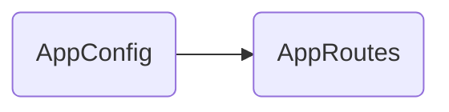

# AppConfig

## Descripción
Configuración global de la aplicación inyectada en el bootstrap. Define los providers globales: error listeners y router con rutas.

## API / Interfaz pública

```typescript
export const appConfig: ApplicationConfig = {
  providers: [
    provideBrowserGlobalErrorListeners(),
    provideRouter(routes)
  ]
};
```

## Grafo de dependencias



| Métrica | Valor |
|---------|-------|
| Fan-out | 1 |
| Fan-in | 1 |

### Dependencias (importa)
| Nota | Archivo | Tipo |
|------|---------|------|
| [[cfg-002]] | src/app/app.routes.ts | config |

### Dependientes (importado por)
| Nota | Archivo |
|------|---------|
| [[comp-001]] | src/app/app.ts |
| [[entry-001]] | src/main.ts |

## Zettelkasten

| Campo | Valor |
|-------|-------|
| ID | `cfg-001` |
| Autor | @lanca |
| Creado | 2025-06-05 |
| Actualizado | 2025-06-05 |
| Tags | angular, config, providers, bootstrap |

### Enlaces salientes
- [[cfg-002]] → AppRoutes para definir rutas

### Enlaces entrantes
- [[comp-001]] → App lo importa en su template
- [[entry-001]] → Main lo usa en bootstrapApplication

## Changelog
| Fecha | Autor | Cambio |
|-------|-------|--------|
| 2025-06-05 | @lanca | documentación inicial |
