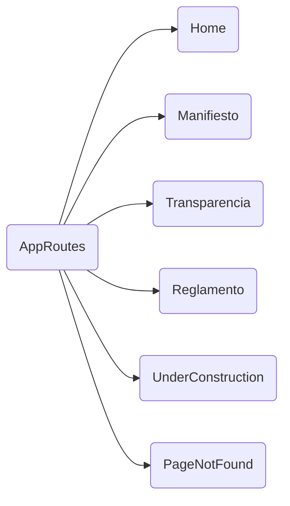

# AppRoutes

## Descripción
Archivo de definición de rutas. Incluye carga directa y lazy loading.

### Rutas actuales
| Path | Componente | Tipo | Carga |
|------|-----------|------|-------|
| `/` | [[comp-004]] Home | página | directa |
| `/manifiesto` | [[comp-011]] Manifiesto | página | directa |
| `/transparencia` | [[comp-005]] Transparencia | página | directa |
| `/reglamento` | [[comp-009]] Reglamento | página | lazy |
| `/archivo` | [[comp-008]] UnderConstruction | placeholder | directa |
| `/privacidad` | [[comp-008]] UnderConstruction | placeholder | directa |
| `**` | [[comp-006]] PageNotFound | 404 | directa |

## API / Interfaz pública

```typescript
export const routes: Routes = [
  { path: '', component: Home },
  { path: 'manifiesto', component: Manifiesto },
  { path: 'transparencia', component: Transparencia },
  { path: 'reglamento', loadComponent: () => import('./pages/reglamento/reglamento').then(m => m.Reglamento) },
  { path: 'archivo', component: UnderConstruction },
  { path: 'privacidad', component: UnderConstruction },
  { path: '**', component: PageNotFound },
];
```

## Grafo de dependencias



| Métrica | Valor |
|---------|-------|
| Fan-out | 6 |
| Fan-in | 2 |

### Dependencias (importa)
| Nota | Archivo | Tipo |
|------|---------|------|
| [[comp-004]] | src/app/pages/home/home.ts | directa |
| [[comp-011]] | src/app/pages/manifiesto/manifiesto.ts | directa |
| [[comp-005]] | src/app/pages/transparencia/transparencia.ts | directa |
| [[comp-009]] | src/app/pages/reglamento/reglamento.ts | lazy |
| [[comp-008]] | src/app/shared/under-construction/under-construction.ts | directa |
| [[comp-006]] | src/app/shared/page-not-found/page-not-found.ts | directa |

### Dependientes (importado por)
| Nota | Archivo |
|------|---------|
| [[cfg-001]] | src/app/app.config.ts |

## Zettelkasten

| Campo | Valor |
|-------|-------|
| ID | `cfg-002` |
| Autor | @lancast |
| Creado | 2026-06-10 |
| Actualizado | 2026-06-10 |
| Tags | angular, routes, routing |

### Enlaces salientes
- [[comp-004]] — Home en ruta `/`
- [[comp-011]] — Manifiesto en ruta `/manifiesto`
- [[comp-005]] — Transparencia en ruta `/transparencia`
- [[comp-009]] — Reglamento en ruta `/reglamento` (lazy)
- [[comp-008]] — UnderConstruction en `/archivo` y `/privacidad`
- [[comp-006]] — PageNotFound en ruta `**`

### Enlaces entrantes
- [[cfg-001]] → AppConfig provee las rutas al router

## Changelog
| Fecha | Autor | Cambio |
|-------|-------|--------|
| 2026-06-10 | @lancast | actualización: añadidas rutas /manifiesto y /reglamento (lazy) |
