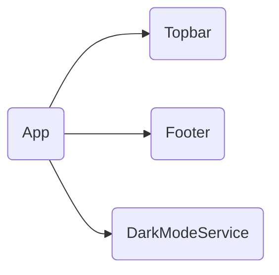

# App

## Descripción
Componente raíz de la aplicación. Define el layout principal:
- [[comp-002]] Topbar (barra de navegación superior)
- `<router-outlet />` para renderizado de páginas
- [[comp-003]] Footer (pie de página)
- Inicializa [[serv-002]] DarkModeService

## API / Interfaz pública

### Selector
`<migala-root>`

## Grafo de dependencias

| Métrica | Valor |
|---------|-------|
| Fan-out | 3 |
| Fan-in | 1 |

### Dependencias (importa)
| Nota | Archivo | Propósito |
|------|---------|-----------|
| [[comp-002]] | src/app/layout/topbar/topbar.ts | Barra de navegación superior |
| [[comp-003]] | src/app/layout/footer/footer.ts | Pie de página |
| [[serv-002]] | src/app/core/services/dark-mode.service.ts | Servicio de modo oscuro |

### Dependientes (importado por)
| Nota | Archivo |
|------|---------|
| [[entry-001]] | src/main.ts |

## Zettelkasten

| Campo | Valor |
|-------|-------|
| ID | `comp-001` |
| Autor | @lancast |
| Creado | 2026-06-10 |
| Actualizado | 2026-06-10 |
| Tags | angular, component, root, layout |

### Enlaces salientes
- [[comp-002]] → Topbar como parte del layout
- [[comp-003]] → Footer como parte del layout
- [[serv-002]] → DarkModeService se inicializa al instanciarse

### Enlaces entrantes
- [[entry-001]] → Main bootstrapea este componente

## Changelog
| Fecha | Autor | Cambio |
|-------|-------|--------|
| 2026-06-10 | @lancast | actualización de dependencias con Topbar, Footer, DarkModeService |
