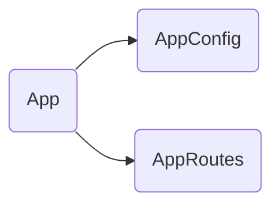

# App

## Descripción
Componente raíz de la aplicación. Define el layout principal con header, hero section con buscador, banner informativo, secciones de contenido en zig-zag (Directorio, Censo, Área Financiera) y footer.

## API / Interfaz pública

### Selector
`<app-root>`

### Señales
| Señal | Tipo | Descripción |
|-------|------|-------------|
| `title` | `WritableSignal<string>` | Título de la aplicación |

## Grafo de dependencias

| Métrica | Valor |
|---------|-------|
| Fan-out | 2 |
| Fan-in | 1 |

### Dependencias (importa)
| Nota | Archivo | Tipo |
|------|---------|------|
| [[cfg-001]] | src/app/app.config.ts | config |
| [[cfg-002]] | src/app/app.routes.ts | config |

### Dependientes (importado por)
| Nota | Archivo |
|------|---------|
| [[entry-001]] | src/main.ts |

## Zettelkasten

| Campo | Valor |
|-------|-------|
| ID | `comp-001` |
| Autor | @lanca |
| Creado | 2025-06-05 |
| Actualizado | 2025-06-05 |
| Tags | angular, component, root, layout |

### Enlaces salientes
- [[cfg-001]] → AppConfig usa el router provider
- [[cfg-002]] → AppRoutes define las rutas del router-outlet

### Enlaces entrantes
- [[entry-001]] → Main bootstrapea este componente

## Changelog
| Fecha | Autor | Cambio |
|-------|-------|--------|
| 2025-06-05 | @lanca | documentación inicial |
