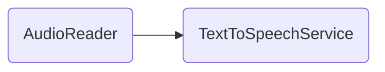

# AudioReader

## Descripción
Componente reutilizable que provee controles de lectura por audio (Text-to-Speech). Incluye:
- Input `textToRead` requerido (string o array de strings)
- Botones: Play, Pause, Resume, Stop
- Selector de voz (lista de voces del sistema)
- Selector de velocidad de lectura
- Exposición del estado `isPlaying` e `isPaused` desde [[serv-003]]
- Auto-stop al destruir el componente (`ngOnDestroy`)

## API / Interfaz pública

### Selector
`<migala-audio-reader />`

### Inputs
| Input | Tipo | Default | Descripción |
|-------|------|---------|-------------|
| `textToRead` | `string \| string[]` | — (required) | Texto o párrafos a leer |

### Propiedades protegidas
| Propiedad | Tipo | Descripción |
|-----------|------|-------------|
| `isPlaying` | `Signal<boolean>` | Indica si está reproduciendo |
| `isPaused` | `Signal<boolean>` | Indica si está pausado |
| `voices` | `Signal<SpeechSynthesisVoice[]>` | Lista de voces disponibles |
| `selectedVoice` | `Signal<SpeechSynthesisVoice \| null>` | Voz seleccionada |
| `rate` | `Signal<number>` | Velocidad de lectura |

## Grafo de dependencias

| Métrica | Valor |
|---------|-------|
| Fan-out | 1 |
| Fan-in | 1 |

### Dependencias (importa)
| Nota | Archivo | Propósito |
|------|---------|-----------|
| [[serv-003]] | src/app/core/services/text-to-speech.service.ts | Servicio de síntesis de voz |

### Dependientes (importado por)
| Nota | Archivo |
|------|---------|
| [[comp-011]] | src/app/pages/manifiesto/manifiesto.ts |

## Zettelkasten

| Campo | Valor |
|-------|-------|
| ID | `comp-012` |
| Autor | @lancast |
| Creado | 2026-06-10 |
| Tags | angular, component, shared, audio, tts, accessibility |

### Enlaces salientes
- [[serv-003]] → TextToSpeechService para toda la lógica de síntesis de voz

### Enlaces entrantes
- [[comp-011]] → Manifiesto lo usa para leer el manifiesto en voz alta

## Changelog
| Fecha | Autor | Cambio |
|-------|-------|--------|
| 2026-06-10 | @lancast | creación del componente AudioReader |
