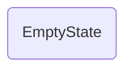

# EmptyState

## Descripción
Componente compartido que renderiza un estado vacío personalizable mediante inputs (`icon`, `title`, `message`) y proyección de contenido con `<ng-content>`.

## API / Interfaz pública

### Selector
`<migala-empty-state />`

### Inputs
| Input | Tipo | Default | Descripción |
|-------|------|---------|-------------|
| `icon` | `string` | `''` | Emoji o SVG inline |
| `title` | `string` | `'Sin contenido'` | Título del estado |
| `message` | `string` | `'No hay información disponible en este momento.'` | Descripción |

### Uso
```html
<migala-empty-state icon="📭" title="Sin resultados" message="No se encontraron coincidencias.">
  <button class="...">Reintentar</button>
</migala-empty-state>
```

## Grafo de dependencias



| Métrica | Valor |
|---------|-------|
| Fan-out | 0 |
| Fan-in | 0 |

## Zettelkasten

| Campo | Valor |
|-------|-------|
| ID | `comp-007` |
| Autor | @lanca |
| Creado | 2025-06-05 |
| Actualizado | 2025-06-05 |
| Tags | angular, component, shared, empty, state |

## Changelog
| Fecha | Autor | Cambio |
|-------|-------|--------|
| 2025-06-05 | @lanca | creación del componente EmptyState |
