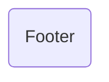

# Footer

## Descripción
Componente de layout que renderiza el pie de página. Incluye:
- Logo completo de Proyecto Migala
- Eslogan: "Ciencia, Tierra y Libertad"
- Sección de redes sociales (placeholder)

## API / Interfaz pública

### Selector
`<migala-footer />`

## Grafo de dependencias

| Métrica | Valor |
|---------|-------|
| Fan-out | 0 |
| Fan-in | 1 |

### Dependencias
Ninguna (sin imports relativos)

### Dependientes (importado por)
| Nota | Archivo |
|------|---------|
| [[comp-001]] | src/app/app.ts |

## Zettelkasten

| Campo | Valor |
|-------|-------|
| ID | `comp-003` |
| Autor | @lanca |
| Creado | 2025-06-05 |
| Actualizado | 2025-06-05 |
| Tags | angular, component, layout, footer |

### Enlaces salientes
Ninguno

### Enlaces entrantes
- [[comp-001]] → App lo usa como parte del layout

## Changelog
| Fecha | Autor | Cambio |
|-------|-------|--------|
| 2025-06-05 | @lanca | creación del componente Footer |
