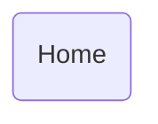

# Home

## Descripción
Página de inicio de la aplicación. Muestra:
- Hero section con buscador y fondo de banner
- Banner morado informativo con curva decorativa
- Secciones en zig-zag: Directorio, Censo Nacional 2026, Área Financiera

## API / Interfaz pública

### Selector
`<migala-home />`

### Ruta
`/` (raíz)

## Grafo de dependencias

| Métrica | Valor |
|---------|-------|
| Fan-out | 0 |
| Fan-in | 1 |

### Dependencias
Ninguna (sin imports relativos)

### Dependientes (importado por)
| Nota | Archivo |
|------|---------|
| [[cfg-002]] | src/app/app.routes.ts |

## Zettelkasten

| Campo | Valor |
|-------|-------|
| ID | `comp-004` |
| Autor | @lanca |
| Creado | 2025-06-05 |
| Actualizado | 2025-06-05 |
| Tags | angular, component, page, home, hero, landing |

### Enlaces salientes
Ninguno

### Enlaces entrantes
- [[cfg-002]] → AppRoutes registra la ruta `/`

## Changelog
| Fecha | Autor | Cambio |
|-------|-------|--------|
| 2025-06-05 | @lanca | creación de la página Home |
