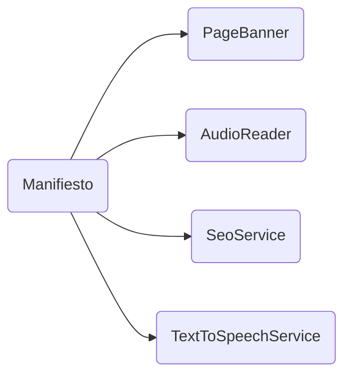

# Manifiesto

## Descripción
Página que muestra el Manifiesto del Proyecto Migala. Incluye:
- Banner decorativo vía [[comp-010]] PageBanner
- Múltiples secciones con contenido ideológico
- Componente [[comp-012]] AudioReader para lectura por voz
- Inyección de [[serv-001]] SeoService para generación de tags SEO
- Inyección de [[serv-003]] TextToSpeechService para funcionalidad de audio

## API / Interfaz pública

### Selector
`<migala-manifiesto />`

### Ruta
`/manifiesto`

### Propiedades protegidas
| Propiedad | Tipo | Descripción |
|-----------|------|-------------|
| `sections` | `Section[]` | Arreglo de secciones del manifiesto |
| `activeSectionId` | `WritableSignal<string>` | ID de la sección activa |

## Grafo de dependencias

| Métrica | Valor |
|---------|-------|
| Fan-out | 4 |
| Fan-in | 1 |

### Dependencias (importa)
| Nota | Archivo | Propósito |
|------|---------|-----------|
| [[comp-010]] | src/app/shared/page-banner/page-banner.ts | Banner decorativo de página |
| [[comp-012]] | src/app/shared/audio-reader/audio-reader.ts | Control de lectura por voz |
| [[serv-001]] | src/app/core/services/seo.service.ts | Tags SEO/Open Graph |
| [[serv-003]] | src/app/core/services/text-to-speech.service.ts | Servicio de texto a voz |

### Dependientes (importado por)
| Nota | Archivo |
|------|---------|
| [[cfg-002]] | src/app/app.routes.ts |

## Zettelkasten

| Campo | Valor |
|-------|-------|
| ID | `comp-011` |
| Autor | @lancast |
| Creado | 2026-06-10 |
| Tags | angular, component, page, manifiesto, manifesto |

### Enlaces salientes
- [[comp-010]] → PageBanner para el banner de la página
- [[comp-012]] → AudioReader para funcionalidad TTS
- [[serv-001]] → SeoService genera metadata
- [[serv-003]] → TextToSpeechService para lectura en voz alta

### Enlaces entrantes
- [[cfg-002]] → AppRoutes registra la ruta `/manifiesto`

## Changelog
| Fecha | Autor | Cambio |
|-------|-------|--------|
| 2026-06-10 | @lancast | creación del componente Manifiesto |
