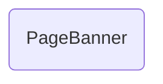

# PageBanner

## Descripción
Componente reutilizable que renderiza un banner decorativo para páginas. Incluye:
- Input `title` requerido para el título del banner
- Input `description` opcional para texto descriptivo
- Input `variant` con dos temas: `'migala'` (morado, espaciado amplio) y `'migala-sky'` (celeste, espaciado compacto)
- Clases computadas dinámicamente con `computed()` según la variante seleccionada
- Borde inferior redondeado decorativo (`rounded-b-[50%]`)

## API / Interfaz pública

### Selector
`<migala-page-banner />`

### Inputs
| Input | Tipo | Default | Descripción |
|-------|------|---------|-------------|
| `title` | `string` | — (required) | Título del banner |
| `description` | `string` | `''` | Descripción opcional |
| `variant` | `'migala' \| 'migala-sky'` | `'migala'` | Tema visual del banner |

## Grafo de dependencias

| Métrica | Valor |
|---------|-------|
| Fan-out | 0 |
| Fan-in | 2 |

### Dependencias
Ninguna (sin imports relativos)

### Dependientes (importado por)
| Nota | Archivo |
|------|---------|
| [[comp-005]] | src/app/pages/transparencia/transparencia.ts |
| [[comp-011]] | src/app/pages/manifiesto/manifiesto.ts |

## Zettelkasten

| Campo | Valor |
|-------|-------|
| ID | `comp-010` |
| Autor | @lancast |
| Creado | 2026-06-10 |
| Tags | angular, component, shared, banner, ui |

### Enlaces salientes
Ninguno

### Enlaces entrantes
- [[comp-005]] → Transparencia lo usa para el banner de página
- [[comp-011]] → Manifiesto lo usa para el banner de página

## Changelog
| Fecha | Autor | Cambio |
|-------|-------|--------|
| 2026-06-10 | @lancast | creación del componente PageBanner |
