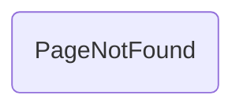

# PageNotFound

## Descripción
Componente compartido que muestra una página de error 404 con mensaje y botón para volver al inicio.

## API / Interfaz pública

### Selector
`<migala-page-not-found />`

### Dependencias
- `RouterLink` — para navegación al home

### Uso
```typescript
import { PageNotFound } from './shared/page-not-found/page-not-found';

@Component({
  imports: [PageNotFound],
  template: `<migala-page-not-found />`
})
```

## Grafo de dependencias



| Métrica | Valor |
|---------|-------|
| Fan-out | 0 |
| Fan-in | 1 |

### Dependientes (importado por)
| Nota | Archivo |
|------|---------|
| [[cfg-002]] | src/app/app.routes.ts |

## Zettelkasten

| Campo | Valor |
|-------|-------|
| ID | `comp-006` |
| Autor | @lanca |
| Creado | 2025-06-05 |
| Actualizado | 2025-06-05 |
| Tags | angular, component, shared, 404, error |

### Enlaces entrantes
- [[cfg-002]] → AppRoutes lo usa en la ruta comodín `**`

## Changelog
| Fecha | Autor | Cambio |
|-------|-------|--------|
| 2025-06-05 | @lanca | creación del componente PageNotFound |
