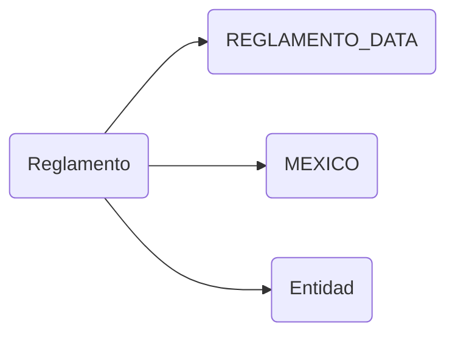

# Reglamento

## Descripción
Página de consulta del Reglamento Nacional del Proyecto Migala. Incluye:
- Sistema de 8 tabs: Nacional, Comisiones Estatales, Grupos Operativos, Comisiones Temáticas, Transversalidad, Procedimientos, Conductas y Sanciones, Modificaciones
- Buscador de artículos con filtro por tipo semántico (principio, definición, requisito, procedimiento, sanción, etc.)
- Table of Contents (TOC) con estructura de títulos y capítulos
- Grid de 32 entidades federativas agrupadas por región en el tab "Comisiones Estatales"
- Buscador de estados con filtro por nombre, capital o abreviatura
- Métricas en tiempo real: total de artículos, distribución por tipo, palabras
- Scroll suave a artículos individuales

## API / Interfaz pública

### Selector
`<migala-reglamento />`

### Ruta
`/reglamento` (lazy-loaded)

### Propiedades públicas
| Propiedad | Tipo | Descripción |
|-----------|------|-------------|
| `reglamento` | `Signal<Reglamento>` | Datos completos del reglamento |
| `metrics` | `Computed<ReglamentoMetrics \| null>` | Métricas globales |
| `estados` | `Estado[]` | Las 32 entidades federativas |
| `activeTab` | `WritableSignal<string>` | Tab activo actual |
| `searchQuery` | `WritableSignal<string>` | Texto de búsqueda de artículos |
| `searchEstado` | `WritableSignal<string>` | Texto de búsqueda de estados |
| `typeFilter` | `WritableSignal<ArticuloType \| null>` | Filtro por tipo de artículo |
| `showToc` | `WritableSignal<boolean>` | Control de visibilidad del TOC |

### Métodos públicos
| Método | Descripción |
|--------|-------------|
| `setTab(tabId: string)` | Cambia de tab y resetea filtros |
| `toggleToc()` | Alterna visibilidad del TOC |
| `scrollToArticle(articleNumber: string)` | Scroll suave a un artículo |
| `groupArticles(articles)` | Agrupa artículos por título |
| `formatReferences(refs)` | Formatea referencias cruzadas |

## Grafo de dependencias

| Métrica | Valor |
|---------|-------|
| Fan-out | 3 |
| Fan-in | 1 |

### Dependencias (importa)
| Nota | Archivo | Propósito |
|------|---------|-----------|
| [[data-002]] | src/app/core/data/reglamento.data.ts | Datos completos del reglamento nacional |
| [[data-001]] | src/app/core/data/entidades.data.ts | Constante MEXICO con 32 estados |
| [[model-001]] | src/app/core/models/entidad.ts | Interfaz Estado para tipado |

### Dependientes (importado por)
| Nota | Archivo |
|------|---------|
| [[cfg-002]] | src/app/app.routes.ts (lazy load) |

## Zettelkasten

| Campo | Valor |
|-------|-------|
| ID | `comp-009` |
| Autor | @lancast |
| Creado | 2026-06-10 |
| Tags | angular, component, page, reglamento, tabs, search, articulos |

### Enlaces salientes
- [[data-002]] → REGLAMENTO_DATA fuente de artículos, títulos y capítulos
- [[data-001]] → MEXICO para el grid de Comisiones Estatales
- [[model-001]] → Estado type para tipado de entidades federativas

### Enlaces entrantes
- [[cfg-002]] → AppRoutes registra la ruta `/reglamento` con lazy loading

## Changelog
| Fecha | Autor | Cambio |
|-------|-------|--------|
| 2026-06-10 | @lancast | creación del componente Reglamento |
