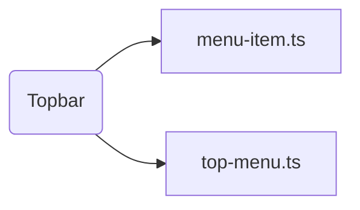

# Topbar

## Descripción
Componente de layout que renderiza la barra de navegación superior. Incluye:
- Logo de Proyecto Migala (izquierda)
- Menú desktop con `@for` sobre `TOP_MENU`
- Menú mobile con hamburguesa animada (☰ ↔ ✕) y dropdown con `max-height` animado

## Arquitectura

```
topbar/
├── menu-item.ts      # Interface MenuItem { label, route, exact?, lines? }
├── top-menu.ts       # MenuItem[] — fuente única de la navegación
├── topbar.ts         # Componente con signal isMenuOpen
└── topbar.html       # @for + [class.opacity-0] + [style.max-height]
```

### Señales (Signals)
- `isMenuOpen: signal(false)` — controla apertura del menú mobile

### Métodos
- `toggleMenu()` — alterna el menú mobile
- `closeMenu()` — cierra menú (se llama al hacer click en un link)

## API / Interfaz pública

### Selector
`<migala-topbar />`

### Dependencias
- `RouterLink` — navegación declarativa
- `RouterLinkActive` — clase activa en link actual

### Uso
```html
<migala-topbar />
```

## Grafo de dependencias



| Métrica | Valor |
|---------|-------|
| Fan-out | 0 |
| Fan-in | 1 |

### Dependencias locales
- `menu-item.ts` — interface
- `top-menu.ts` — datos del menú

### Dependientes (importado por)
| Nota | Archivo |
|------|---------|
| [[comp-001]] | src/app/app.ts |

## Zettelkasten

| Campo | Valor |
|-------|-------|
| ID | `comp-002` |
| Autor | @lanca |
| Creado | 2025-06-05 |
| Actualizado | 2025-06-05 |
| Tags | angular, component, layout, navigation, topbar, mobile |

### Enlaces salientes
- [[comp-006]] — PageNotFound (mismo patrón de componente compartido)
- [[comp-007]] — EmptyState
- [[comp-008]] — UnderConstruction

### Enlaces entrantes
- [[comp-001]] → App lo usa como parte del layout

## Changelog
| Fecha | Autor | Cambio |
|-------|-------|--------|
| 2025-06-05 | @lanca | creación del componente Topbar |
| 2025-06-05 | @lanca | refactor: interface MenuItem + top-menu.ts con @for |
| 2025-06-05 | @lanca | mobile: hamburguesa SVG + dropdown animado con signal |
