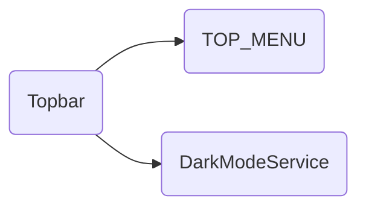

# Topbar

## Descripción
Componente de layout que renderiza la barra de navegación superior. Incluye:
- Logo de Proyecto Migala (izquierda)
- Menú desktop con `@for` sobre [[data-004]] TOP_MENU
- Menú mobile con hamburguesa animada (☰ ↔ ✕) y dropdown con `max-height` animado
- Toggle de modo oscuro via [[serv-002]] DarkModeService

## Arquitectura

```
topbar/
├── menu-item.ts      # Interface MenuItem [[data-005]]
├── top-menu.ts       # MenuItem[] — fuente única de la navegación [[data-004]]
├── topbar.ts         # Componente con signal isMenuOpen
└── topbar.html       # @for + [class.opacity-0] + [style.max-height]
```

### Señales (Signals)
- `isMenuOpen: signal(false)` — controla apertura del menú mobile

### Métodos
- `toggleMenu()` — alterna el menú mobile
- `closeMenu()` — cierra menú (se llama al hacer click en un link)
- `toggleDark()` — alterna modo oscuro/claro

## API / Interfaz pública

### Selector
`<migala-topbar />`

### Dependencias
- `RouterLink` — navegación declarativa
- `RouterLinkActive` — clase activa en link actual

### Uso
```html
<migala-topbar />
```

## Grafo de dependencias



| Métrica | Valor |
|---------|-------|
| Fan-out | 2 |
| Fan-in | 1 |

### Dependencias (importa)
| Nota | Archivo | Propósito |
|------|---------|-----------|
| [[data-004]] | src/app/layout/topbar/top-menu.ts | Datos del menú de navegación |
| [[serv-002]] | src/app/core/services/dark-mode.service.ts | Toggle de modo oscuro |

### Dependientes (importado por)
| Nota | Archivo |
|------|---------|
| [[comp-001]] | src/app/app.ts |

## Zettelkasten

| Campo | Valor |
|-------|-------|
| ID | `comp-002` |
| Autor | @lancast |
| Creado | 2026-06-10 |
| Actualizado | 2026-06-10 |
| Tags | angular, component, layout, navigation, topbar, mobile, dark-mode |

### Enlaces salientes
- [[data-004]] → TOP_MENU para las entradas del menú
- [[serv-002]] → DarkModeService para toggle de tema

### Enlaces entrantes
- [[comp-001]] → App lo usa como parte del layout

## Changelog
| Fecha | Autor | Cambio |
|-------|-------|--------|
| 2026-06-10 | @lancast | actualización con TOP_MENU y DarkModeService |
