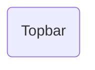

# Topbar

## Descripción
Componente de layout que renderiza la barra de navegación superior. Incluye:
- Logo de Proyecto Migala (izquierda)
- Enlaces de navegación: Inicio, Transparencia, Archivo, Aviso de privacidad

## API / Interfaz pública

### Selector
`<migala-topbar />`

### Dependencias
- `RouterLink` — para navegación declarativa (usado en el template)

## Grafo de dependencias

| Métrica | Valor |
|---------|-------|
| Fan-out | 0 |
| Fan-in | 1 |

### Dependencias
Ninguna (sin imports relativos)

### Dependientes (importado por)
| Nota | Archivo |
|------|---------|
| [[comp-001]] | src/app/app.ts |

## Zettelkasten

| Campo | Valor |
|-------|-------|
| ID | `comp-002` |
| Autor | @lanca |
| Creado | 2025-06-05 |
| Actualizado | 2025-06-05 |
| Tags | angular, component, layout, navigation, topbar |

### Enlaces salientes
Ninguno

### Enlaces entrantes
- [[comp-001]] → App lo usa como parte del layout

## Changelog
| Fecha | Autor | Cambio |
|-------|-------|--------|
| 2025-06-05 | @lanca | creación del componente Topbar |
