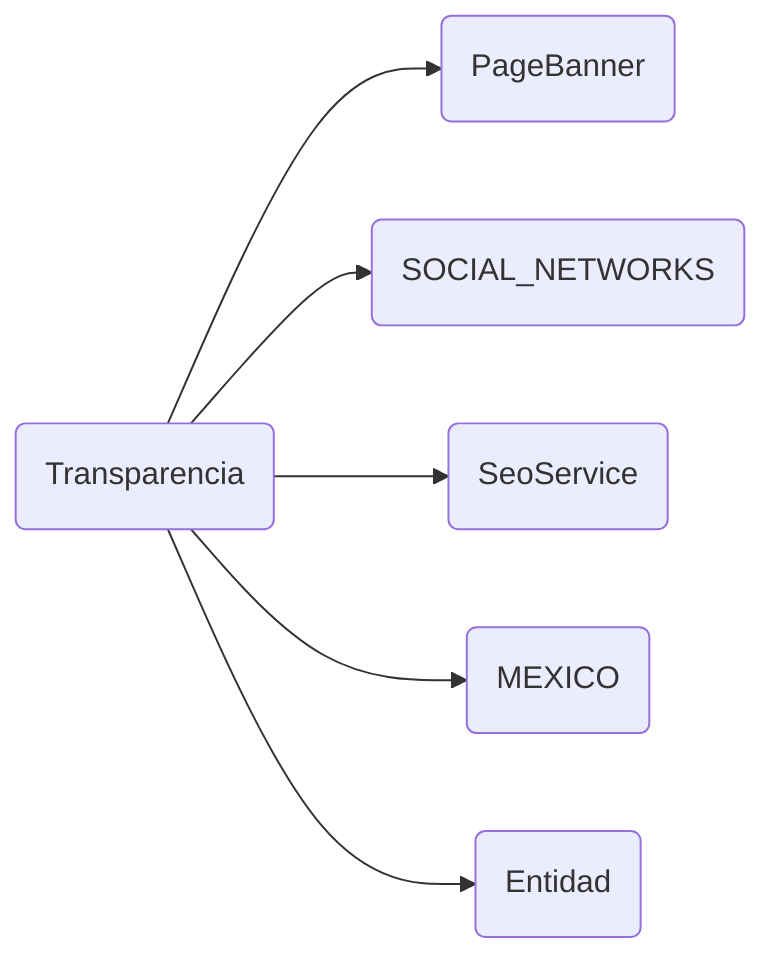

# Transparencia

## Descripción
Página de transparencia institucional. Incluye:
- Banner decorativo via [[comp-010]] PageBanner
- 13 secciones en acordeón: Redes Sociales, Manifiesto, Reglamento, Comisiones Estatales, Ruta Crítica, Directorios, Organigrama, Sesiones, Conversatorios, Calendario, Patrimonio, Ingresos/Egresos, Trámites, Talleres
- Sección "Comisiones Estatales" con grid de las 32 entidades federativas agrupadas por región
- Buscador de estados con filtro por nombre, capital o abreviatura
- Redes sociales desde [[data-003]] SOCIAL_NETWORKS
- SEO dinámico via [[serv-001]] SeoService

## API / Interfaz pública

### Selector
`<migala-transparencia />`

### Ruta
`/transparencia`

### Propiedades protegidas
| Propiedad | Tipo | Descripción |
|-----------|------|-------------|
| `sections` | `TransparenciaSection[]` | Arreglo de secciones de transparencia |
| `socialNetworks` | `SocialNetwork[]` | Redes sociales oficiales |
| `estados` | `Estado[]` | Las 32 entidades federativas |
| `openSectionId` | `WritableSignal<string \| null>` | Sección abierta en el acordeón |
| `searchEstado` | `WritableSignal<string>` | Búsqueda de estados |
| `filteredEstados` | `Computed<Estado[]>` | Estados filtrados por búsqueda |
| `estadosPorRegion` | `Computed<Map<string, Estado[]>>` | Estados agrupados por región |

## Grafo de dependencias

| Métrica | Valor |
|---------|-------|
| Fan-out | 5 |
| Fan-in | 1 |

### Dependencias (importa)
| Nota | Archivo | Propósito |
|------|---------|-----------|
| [[comp-010]] | src/app/shared/page-banner/page-banner.ts | Banner decorativo de página |
| [[data-003]] | src/app/core/social-networks.ts | Redes sociales oficiales |
| [[serv-001]] | src/app/core/services/seo.service.ts | Generación de tags SEO |
| [[data-001]] | src/app/core/data/entidades.data.ts | Datos de los 32 estados |
| [[model-001]] | src/app/core/models/entidad.ts | Interfaz Estado para tipado |

### Dependientes (importado por)
| Nota | Archivo |
|------|---------|
| [[cfg-002]] | src/app/app.routes.ts |

## Zettelkasten

| Campo | Valor |
|-------|-------|
| ID | `comp-005` |
| Autor | @lancast |
| Creado | 2026-06-10 |
| Actualizado | 2026-06-10 |
| Tags | angular, component, page, transparencia, documentos, estados, seo |

### Enlaces salientes
- [[comp-010]] → PageBanner para banner decorativo
- [[data-003]] → SOCIAL_NETWORKS para directorio de redes
- [[serv-001]] → SeoService genera SEO dinámico
- [[data-001]] → MEXICO para grid de Comisiones Estatales
- [[model-001]] → Estado type para tipado de entidades

### Enlaces entrantes
- [[cfg-002]] → AppRoutes registra la ruta `/transparencia`

## Changelog
| Fecha | Autor | Cambio |
|-------|-------|--------|
| 2026-06-10 | @lancast | actualización mayor: PageBanner, SOCIAL_NETWORKS, SEO, grid de 32 estados agrupados por región |
