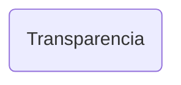

# Transparencia

## Descripción
Página de transparencia institucional. Muestra:
- Banner morado claro con título "Transparencia" y descripción
- Sección explicativa: "¿Sabes para qué sirve la transparencia?"
- Lista de documentos y recursos: Manifiesto, Redes Sociales, Reglamento, Ruta Crítica, Directorios, Organigrama, Sesiones, Conversatorios, Calendario, Patrimonio, Ingresos/Egresos, Trámites, Talleres

## API / Interfaz pública

### Selector
`<migala-transparencia />`

### Ruta
`/transparencia`

## Grafo de dependencias

| Métrica | Valor |
|---------|-------|
| Fan-out | 0 |
| Fan-in | 1 |

### Dependencias
Ninguna (sin imports relativos)

### Dependientes (importado por)
| Nota | Archivo |
|------|---------|
| [[cfg-002]] | src/app/app.routes.ts |

## Zettelkasten

| Campo | Valor |
|-------|-------|
| ID | `comp-005` |
| Autor | @lanca |
| Creado | 2025-06-05 |
| Actualizado | 2025-06-05 |
| Tags | angular, component, page, transparencia, documentos |

### Enlaces salientes
Ninguno

### Enlaces entrantes
- [[cfg-002]] → AppRoutes registra la ruta `/transparencia`

## Changelog
| Fecha | Autor | Cambio |
|-------|-------|--------|
| 2025-06-05 | @lanca | creación de la página Transparencia |
