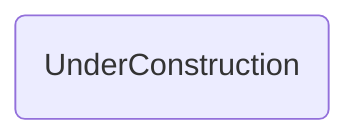

# UnderConstruction

## Descripción
Componente compartido que muestra un mensaje de "Página en construcción" con animación de puntos. Se usa como placeholder para rutas no implementadas (Archivo, Privacidad).

## API / Interfaz pública

### Selector
`<migala-under-construction />`

### Uso
```typescript
import { UnderConstruction } from './shared/under-construction/under-construction';

@Component({
  imports: [UnderConstruction],
  template: `<migala-under-construction />`
})
```

## Grafo de dependencias



| Métrica | Valor |
|---------|-------|
| Fan-out | 0 |
| Fan-in | 1 |

### Dependientes (importado por)
| Nota | Archivo |
|------|---------|
| [[cfg-002]] | src/app/app.routes.ts |

## Zettelkasten

| Campo | Valor |
|-------|-------|
| ID | `comp-008` |
| Autor | @lanca |
| Creado | 2025-06-05 |
| Actualizado | 2025-06-05 |
| Tags | angular, component, shared, construction, placeholder |

### Enlaces entrantes
- [[cfg-002]] → AppRoutes lo usa en las rutas `/archivo` y `/privacidad`

## Changelog
| Fecha | Autor | Cambio |
|-------|-------|--------|
| 2025-06-05 | @lanca | creación del componente UnderConstruction |
