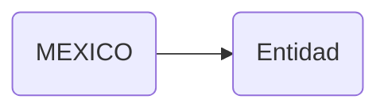

# MEXICO (entidades data)

## Descripción
Constante `MEXICO: Pais` que contiene los 32 estados de México con todos sus municipios. Incluye:
- 32 entidades federativas con datos completos (id INEGI, nombre, nombre oficial, abreviatura, capital, región)
- Aprox. 2,469 municipios con clave INEGI y nombre
- Datos fuente: INEGI Marco Geoestadístico

## API / Interfaz pública

### Constante exportada
| Nombre | Tipo | Descripción |
|--------|------|-------------|
| `MEXICO` | `Pais` | Objeto país con arreglo de 32 estados |

## Grafo de dependencias

| Métrica | Valor |
|---------|-------|
| Fan-out | 1 |
| Fan-in | 2 |

### Dependencias (importa)
| Nota | Archivo | Propósito |
|------|---------|-----------|
| [[model-001]] | src/app/core/models/entidad.ts | Interfaces Pais, Estado para tipado |

### Dependientes (importado por)
| Nota | Archivo |
|------|---------|
| [[comp-005]] | src/app/pages/transparencia/transparencia.ts |
| [[comp-009]] | src/app/pages/reglamento/reglamento.ts |

## Zettelkasten

| Campo | Valor |
|-------|-------|
| ID | `data-001` |
| Autor | @lancast |
| Creado | 2026-06-10 |
| Tags | angular, data, constant, mexico, estados, municipios, inegi |

### Enlaces salientes
- [[model-001]] → Entidad model provee las interfaces para tipado

### Enlaces entrantes
- [[comp-005]] → Transparencia usa MEXICO para grid de Comisiones Estatales
- [[comp-009]] → Reglamento usa MEXICO para grid de entidades federativas

## Changelog
| Fecha | Autor | Cambio |
|-------|-------|--------|
| 2026-06-10 | @lancast | creación de la constante MEXICO |
