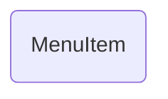

# MenuItem (interface)

## Descripción
Interfaz que define la estructura de una entrada del menú de navegación. Incluye:
- `label` — texto visible del enlace
- `route` — ruta Angular (routerLink)
- `exact?` — indica si el match debe ser exacto (para home)
- `lines?` — permite dividir el label en múltiples líneas

## API / Interfaz pública

### Interfaz exportada
| Propiedad | Tipo | Default | Descripción |
|-----------|------|---------|-------------|
| `label` | `string` | — | Texto visible del menú |
| `route` | `string` | — | Ruta de navegación |
| `exact?` | `boolean` | `false` | Match exacto del router |
| `lines?` | `string[]` | — | Labels multi-línea |

## Grafo de dependencias

| Métrica | Valor |
|---------|-------|
| Fan-out | 0 |
| Fan-in | 1 |

### Dependencias
Ninguna

### Dependientes (importado por)
| Nota | Archivo |
|------|---------|
| [[data-004]] | src/app/layout/topbar/top-menu.ts |

## Zettelkasten

| Campo | Valor |
|-------|-------|
| ID | `data-005` |
| Autor | @lancast |
| Creado | 2026-06-10 |
| Tags | angular, data, interface, menu, navigation |

### Enlaces salientes
Ninguno

### Enlaces entrantes
- [[data-004]] → TOP_MENU usa MenuItem para tipar el arreglo de menú

## Changelog
| Fecha | Autor | Cambio |
|-------|-------|--------|
| 2026-06-10 | @lancast | creación de la interfaz MenuItem |
