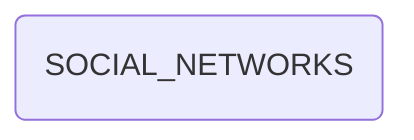

# SOCIAL_NETWORKS (social networks)

## Descripción
Constante `SOCIAL_NETWORKS: SocialNetwork[]` que contiene las 6 redes sociales oficiales del Proyecto Migala a nivel nacional. Incluye:
- Telegram, YouTube, Instagram, TikTok, X (Twitter), Facebook
- URL oficial de cada red
- Icono via Google S2 Favicon service
- Función utilitaria `getFaviconUrl()` para generar URLs de favicon

## API / Interfaz pública

### Constante exportada
| Nombre | Tipo | Descripción |
|--------|------|-------------|
| `SOCIAL_NETWORKS` | `SocialNetwork[]` | Arreglo con 6 redes sociales |

### Función utilitaria
| Función | Descripción |
|---------|-------------|
| `getFaviconUrl(domain, size?)` | Genera URL de favicon via Google S2 |

## Grafo de dependencias

| Métrica | Valor |
|---------|-------|
| Fan-out | 0 |
| Fan-in | 2 |

### Dependencias
Ninguna

### Dependientes (importado por)
| Nota | Archivo |
|------|---------|
| [[comp-003]] | src/app/layout/footer/footer.ts |
| [[comp-005]] | src/app/pages/transparencia/transparencia.ts |

## Zettelkasten

| Campo | Valor |
|-------|-------|
| ID | `data-003` |
| Autor | @lancast |
| Creado | 2026-06-10 |
| Tags | angular, data, constant, social, networks, redes |

### Enlaces salientes
Ninguno

### Enlaces entrantes
- [[comp-003]] → Footer renderiza los iconos de redes sociales
- [[comp-005]] → Transparencia muestra el directorio de redes

## Changelog
| Fecha | Autor | Cambio |
|-------|-------|--------|
| 2026-06-10 | @lancast | creación de la constante SOCIAL_NETWORKS |
