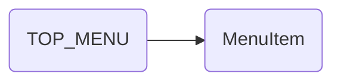

# TOP_MENU (top menu)

## Descripción
Constante `TOP_MENU: MenuItem[]` que define las entradas del menú de navegación principal. Incluye:
- 6 entradas: Inicio, Manifiesto, Transparencia, Reglamentos, Archivo, Aviso de privacidad
- Propiedad `exact` para el home route (`/`)
- Propiedad `lines` para dividir labels en múltiples líneas (Aviso de privacidad)

## API / Interfaz pública

### Constante exportada
| Nombre | Tipo | Descripción |
|--------|------|-------------|
| `TOP_MENU` | `MenuItem[]` | Arreglo con 6 entradas de menú |

## Grafo de dependencias

| Métrica | Valor |
|---------|-------|
| Fan-out | 1 |
| Fan-in | 1 |

### Dependencias (importa)
| Nota | Archivo | Propósito |
|------|---------|-----------|
| [[data-005]] | src/app/layout/topbar/menu-item.ts | Interfaz MenuItem para tipado |

### Dependientes (importado por)
| Nota | Archivo |
|------|---------|
| [[comp-002]] | src/app/layout/topbar/topbar.ts |

## Zettelkasten

| Campo | Valor |
|-------|-------|
| ID | `data-004` |
| Autor | @lancast |
| Creado | 2026-06-10 |
| Tags | angular, data, constant, menu, navigation, topbar |

### Enlaces salientes
- [[data-005]] → MenuItem interface para tipado de cada entrada

### Enlaces entrantes
- [[comp-002]] → Topbar consume TOP_MENU para renderizar la navegación

## Changelog
| Fecha | Autor | Cambio |
|-------|-------|--------|
| 2026-06-10 | @lancast | creación de la constante TOP_MENU |
