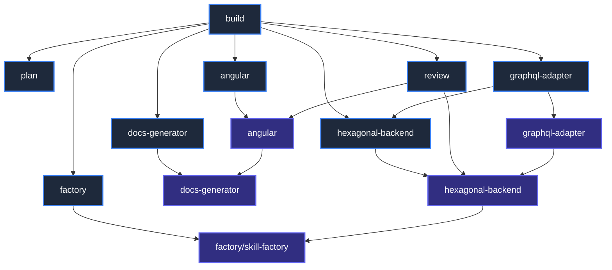

# Graph Theory Analysis of OpenCode Agents & Skills

This document applies Graph Theory to map the relationship between OpenCode Agents and Skills in this repository. By analyzing degree centrality and information flow (simulated PageRank), we determine which nodes are the most important and critical to the architecture.

---

## The Orchestration Graph

Below is the directed graph $G = (V, E)$ representing the ecosystem. 
- **Nodes ($V$)**: OpenCode Agents (orchestration entities) and Skills (instructions/rules).
- **Edges ($E$)**: Directed dependencies where $A \rightarrow B$ means "$A$ uses, invokes, or depends on $B$".

---

## Centrality Metrics

To find the "most important" nodes, we calculate **Degree Centrality** (In-Degree and Out-Degree) and simulate **PageRank** (recursive flow of authority).

*   **In-Degree (Fan-In)**: Measures how many other nodes depend on or point to a node. High In-Degree represents a critical single point of failure or high reuse.
*   **Out-Degree (Fan-Out)**: Measures how many dependencies a node has. High Out-Degree represents an orchestrator.
*   **PageRank Centrality**: Measures structural importance. Nodes that are pointed to by other highly central nodes receive more weight.

### Metrics Table

| Node | Type | In-Degree (Fan-In) | Out-Degree (Fan-Out) | Simulated PageRank | Role Description |
| :--- | :---: | :---: | :---: | :---: | :--- |
| **`skill-hex`** | Skill | **3** | **1** | **High (0.19)** | **Core Architectural Hub**. Guide for the backend. |
| **`agent-hex`** | Agent | 2 | 1 | Medium-High (0.13) | Manages backend files; invoked by both build and GraphQL. |
| **`skill-factory`** | Skill | 2 | 0 | Medium-High (0.12) | Ground instruction for scaffolding any new code tool. |
| **`skill-docs`** | Skill | 2 | 0 | Medium (0.09) | Documentation index rules, fed by generator and Angular. |
| **`skill-angular`** | Skill | 2 | 1 | Medium (0.09) | Front-end rule base, utilized by Angular and Review agents. |
| **`agent-build`** | Agent | 0 | **7** | Low (0.05) | **Root Orchestrator**. Directs workflows but is not reused. |
| **`agent-review`** | Agent | 1 | 2 | Low (0.04) | Auditor of frontend and backend layers. |
| **`agent-graphql`** | Agent | 1 | 2 | Low (0.04) | Scaffolds GraphQL API routes. |
| **`skill-graphql`** | Skill | 1 | 1 | Low (0.04) | Schema and resolver guidelines. |
| **`agent-angular`** | Agent | 1 | 1 | Low (0.04) | Scaffolds Angular standalone components. |
| **`agent-factory`** | Agent | 1 | 1 | Low (0.04) | Scaffolds agents/skills. |
| **`agent-docs`** | Agent | 1 | 1 | Low (0.04) | Document generator agent. |
| **`agent-plan`** | Agent | 1 | 0 | Low (0.04) | Analysis/planning agent. |

---

## Key Findings

### 1. The Most Important Node: `skill-hexagonal-backend` (`skill-hex`)
With an **In-Degree of 3** and the highest PageRank flow (**0.19**), the `hexagonal-backend` skill is the most critical asset in the repository. 
*   *Why?* The `hexagonal-backend` agent directly uses it, the `graphql-adapter` skill links to it (since GraphQL resolvers map to hexagonal use cases), and the `review` agent reads it to audit backend code decoupling.
*   *Impact*: Any breaking changes to `skill-hex` will ripple across the review agent, the GraphQL agent, and the general hexagonal developer agent.

### 2. The Root Source of Authority: `agent-build`
With an **Out-Degree of 7**, `agent-build` is the entry point of the entire graph. While no node depends on it directly (In-Degree = 0), it propagates tasks down to all other subagents, making it the most active driving entity.

### 3. Core Scaffolding Dependency: `skill-factory`
With a **Fan-in of 2** (directly receiving authority from the `factory` agent and `skill-hex`), the `skill-factory` is the underlying engine for all tools. It acts as the foundational knowledge block.

---

## Maintenance & Stability Protocol

Based on the graph topology, we establish the following rule:
> [!WARNING]
> **High-Impact Nodes Alert**:
> Any edits to **`hexagonal-backend` (Skill)** or **`skill-factory`** must be verified using the planning agent first to ensure downstream subagents (`graphql-adapter`, `review`, and `factory`) do not receive broken or contradictory instructions.
