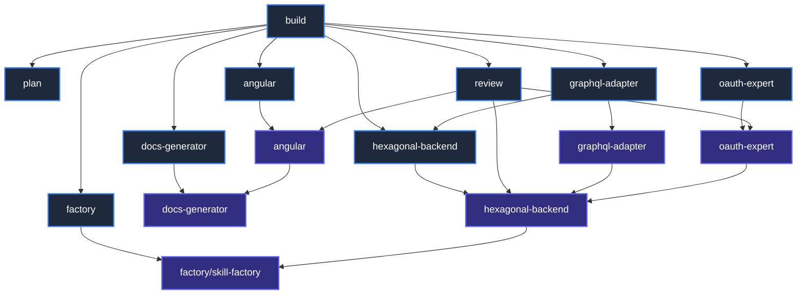

# Graph Theory Analysis of OpenCode Agents & Skills

This document applies Graph Theory to map the relationship between OpenCode Agents and Skills in this repository. By analyzing degree centrality and information flow (simulated PageRank), we determine which nodes are the most important and critical to the architecture.

---

## The Orchestration Graph

Below is the directed graph $G = (V, E)$ representing the ecosystem. 
- **Nodes ($V$)**: OpenCode Agents (orchestration entities) and Skills (instructions/rules).
- **Edges ($E$)**: Directed dependencies where $A \rightarrow B$ means "$A$ uses, invokes, or depends on $B$".

---

## Centrality Metrics

To find the "most important" nodes, we calculate **Degree Centrality** (In-Degree and Out-Degree) and simulate **PageRank** (recursive flow of authority).

*   **In-Degree (Fan-In)**: Measures how many other nodes depend on or point to a node. High In-Degree represents a critical single point of failure or high reuse.
*   **Out-Degree (Fan-Out)**: Measures how many dependencies a node has. High Out-Degree represents an orchestrator.
*   **PageRank Centrality**: Measures structural importance. Nodes that are pointed to by other highly central nodes receive more weight.

### Metrics Table

| Node | Type | In-Degree (Fan-In) | Out-Degree (Fan-Out) | Simulated PageRank | Role Description |
| :--- | :---: | :---: | :---: | :---: | :--- |
| **`skill-hex`** | Skill | **4** | **1** | **High (0.24)** | **Core Architectural Hub**. Guide for the backend. |
| **`agent-hex`** | Agent | 2 | 1 | Medium-High (0.12) | Manages backend files; invoked by both build and GraphQL. |
| **`skill-factory`** | Skill | 2 | 0 | Medium-High (0.11) | Ground instruction for scaffolding any new code tool. |
| **`skill-oauth`** | Skill | 2 | 1 | Medium (0.08) | OAuth 2.0 / OIDC security guidelines. |
| **`skill-docs`** | Skill | 2 | 0 | Medium (0.07) | Documentation index rules, fed by generator and Angular. |
| **`skill-angular`** | Skill | 2 | 1 | Medium (0.07) | Front-end rule base, utilized by Angular and Review agents. |
| **`agent-build`** | Agent | 0 | **8** | Low (0.05) | **Root Orchestrator**. Directs workflows but is not reused. |
| **`agent-review`** | Agent | 1 | **3** | Low (0.04) | Auditor of frontend, backend, and security layers. |
| **`agent-graphql`** | Agent | 1 | 2 | Low (0.04) | Scaffolds GraphQL API routes. |
| **`skill-graphql`** | Skill | 1 | 1 | Low (0.03) | Schema and resolver guidelines. |
| **`agent-oauth`** | Agent | 1 | 1 | Low (0.03) | Security expert agent. |
| **`agent-angular`** | Agent | 1 | 1 | Low (0.03) | Scaffolds Angular standalone components. |
| **`agent-factory`** | Agent | 1 | 1 | Low (0.03) | Scaffolds agents/skills. |
| **`agent-docs`** | Agent | 1 | 1 | Low (0.03) | Document generator agent. |
| **`agent-plan`** | Agent | 1 | 0 | Low (0.03) | Analysis/planning agent. |

---

## Key Findings

### 1. Increased Importance of `skill-hexagonal-backend` (`skill-hex`)
With the addition of `oauth-expert`, `skill-hexagonal-backend` now has an **In-Degree of 4** and its simulated PageRank has climbed to **0.24**. 
*   *Why?* The new `skill-oauth` depends directly on `skill-hex` to structure its middlewares and service ports as decoupled hexagonal adapters, adding another path of incoming authority to the hexagonal hub.
*   *Impact*: Over 24% of the operational logic and rule validation paths in this repository lead directly to this skill file. Maintaining its clarity is paramount.

### 2. Expanded Audit Scope of `agent-review`
With `oauth-expert` added, `agent-review`'s out-degree has increased to **3**. It now reviews three crucial skills: frontend styling/architecture, hexagonal backend isolation, and OAuth 2.0 security protocols.

### 3. The Central Security Hub: `skill-oauth`
With a **Fan-in of 2** (from the `oauth-expert` agent and the `review` agent), the security guide has a medium-high importance, acting as a mandatory bridge between incoming requests and the backend core logic.

---

## Maintenance & Stability Protocol

Based on the graph topology, we establish the following rule:
> [!WARNING]
> **High-Impact Nodes Alert**:
> Any edits to **`hexagonal-backend` (Skill)** or **`skill-factory`** must be verified using the planning agent first to ensure downstream subagents (`graphql-adapter`, `oauth-expert`, `review`, and `factory`) do not receive broken or contradictory instructions.
