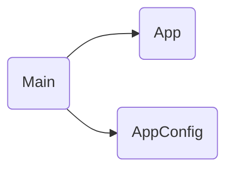

# Main

## Descripción
Punto de entrada de la aplicación. Bootstrapea el componente raíz `App` usando `bootstrapApplication` (standalone API de Angular).

## API / Interfaz pública

```typescript
bootstrapApplication(App, appConfig)
  .catch((err) => console.error(err));
```

## Grafo de dependencias



| Métrica | Valor |
|---------|-------|
| Fan-out | 2 |
| Fan-in | 0 |

### Dependencias (importa)
| Nota | Archivo | Tipo |
|------|---------|------|
| [[comp-001]] | src/app/app.ts | component |
| [[cfg-001]] | src/app/app.config.ts | config |

### Dependientes (importado por)
Ninguno (entry point)

## Zettelkasten

| Campo | Valor |
|-------|-------|
| ID | `entry-001` |
| Autor | @lanca |
| Creado | 2025-06-05 |
| Actualizado | 2025-06-05 |
| Tags | angular, bootstrap, entry-point |

### Enlaces salientes
- [[comp-001]] → App es el componente que bootstrapa
- [[cfg-001]] → AppConfig es la configuración que inyecta

### Enlaces entrantes
Ninguno (es el entry point)

## Changelog
| Fecha | Autor | Cambio |
|-------|-------|--------|
| 2025-06-05 | @lanca | documentación inicial |
