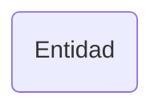

# Entidad (model)

## Descripción
Modelo de datos que define las estructuras geopolíticas de México. Incluye:
- `Region` — tipo union con 6 regiones geográficas: noroeste, noreste, occidente, centro, sureste, sur
- `Municipio` — interface con `id` (clave INEGI 3 dígitos) y `nombre`
- `Estado` — interface con `id`, `nombre`, `nombreOficial`, `abreviatura`, `capital`, `region`, `numMunicipios`, `municipios[]`
- `Pais` — interface con `nombre`, `nombreOficial`, `estados[]`

## API / Interfaz pública

### Tipos exportados
| Nombre | Tipo | Descripción |
|--------|------|-------------|
| `Region` | `'noroeste' \| 'noreste' \| 'occidente' \| 'centro' \| 'sureste' \| 'sur'` | Región geográfica |
| `Municipio` | `interface` | Metadata de municipio |
| `Estado` | `interface` | Metadata de entidad federativa |
| `Pais` | `interface` | País con lista de estados |

## Grafo de dependencias

| Métrica | Valor |
|---------|-------|
| Fan-out | 0 |
| Fan-in | 3 |

### Dependencias
Ninguna

### Dependientes (importado por)
| Nota | Archivo |
|------|---------|
| [[data-001]] | src/app/core/data/entidades.data.ts |
| [[comp-005]] | src/app/pages/transparencia/transparencia.ts |
| [[comp-009]] | src/app/pages/reglamento/reglamento.ts |

## Zettelkasten

| Campo | Valor |
|-------|-------|
| ID | `model-001` |
| Autor | @lancast |
| Creado | 2026-06-10 |
| Tags | angular, model, interface, entidad, estado, municipio, geopolitico |

### Enlaces salientes
Ninguno

### Enlaces entrantes
- [[data-001]] → Entidades data implementa los datos tipados con estas interfaces
- [[comp-005]] → Transparencia usa `Estado` para el grid de entidades
- [[comp-009]] → Reglamento usa `Estado` para el grid de Comisiones Estatales

## Changelog
| Fecha | Autor | Cambio |
|-------|-------|--------|
| 2026-06-10 | @lancast | creación del modelo Entidad |
