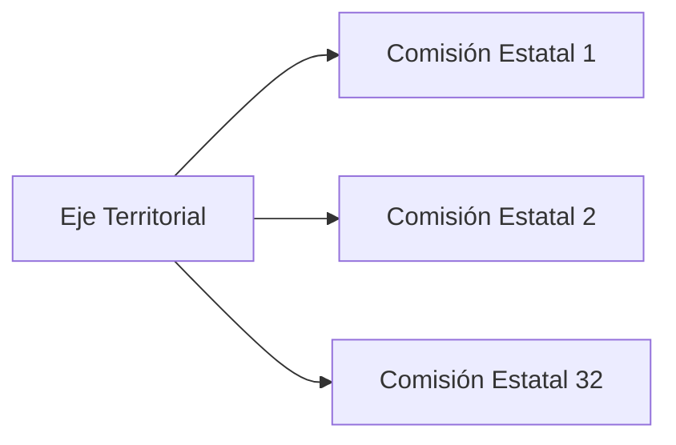

# Estructura de 4 Ejes del Proyecto Migala

## Idea atómica

El Proyecto Migala se organiza en **cuatro ejes** que articulan la participación territorial, especializada, transversal y operativa. Esta estructura busca garantizar **horizontalidad, democracia y pluralidad** con facilidad de participación de todos los miembros.

## Los 4 Ejes (Arts. 11-21)

### Eje Territorial `#territorial #estados`
**Pilar fundamental:** 32 Comisiones Estatales (una por entidad federativa).



→ [[reg-023]] para detalles.

### Eje Especializado `#tematico #conocimiento`
Comisiones Temáticas por áreas del conocimiento humano:

1. Arte y Cultura
2. Ciencia y Tecnología
3. Estudios Económicos
4. Geopolítica e Historia
5. Sustentabilidad
6. Derechos Humanos

→ [[reg-007]] y [[reg-024]] para detalles.

### Eje Operativo `#operativo #horizontalidad`
11 Órganos Garantes de Horizontalidad que ejecutan la operación diaria:

1. Dirección
2. Formación (CONFU)
3. Administración
4. Transparencia
5. Contraloría
6. Comunicación y Propaganda
7. Informática
8. Político Electoral
9. Financiera
10. Legal
11. Diálogo y Arbitraje

→ [[reg-008]] para detalles.

### Eje Transversal `#transversal #vulnerabilidad`
6 Grupos de Perspectiva que incorporan miradas de grupos históricamente relegados:

1. Mujeres
2. Masculinidades
3. Diversidad
4. Pueblos Originarios
5. Personas con Funcionalidad Diversa
6. Paisanos

→ [[reg-009]] y [[reg-025]] para detalles.

## Principios de diseño organizacional

1. **Horizontalidad democrática** (Art. 11)
2. **Paridad de género** (Art. 12-13): 50/50 ideal, 60/40 máximo permitido con plan correctivo
3. **Imparcialidad de titulares** (Art. 14): Actuar con enfoque de protección del área
4. **No acumulación de cargos** (Art. 21): Un miembro no puede ser titular de más de un órgano

## Regla de Paridad (Art. 13)

```
Distribución ideal: 50% mujeres / 50% hombres
Tolerancia máxima: 60% / 40% (por 6 meses máximo)
Si no se cumple en 6 meses → Área Político Electoral impone medidas
Exentos: Grupos de Perspectiva de Género
```

## Modelo de datos (Angular)

```typescript
interface Eje {
  tipo: 'territorial' | 'especializado' | 'transversal' | 'operativo';
  entidades: Organo[];
}

interface Organo {
  nombre: string;
  tipo: 'comision-estatal' | 'comision-tematica' | 'grupo-transversal' | 'area';
  titulares?: { mujer: string; hombre: string }; // Paridad
}
```

## Conexiones

- [[reg-001]] — Esta estructura materializa el objeto del reglamento
- [[reg-002]] — La estructura implementa los principios de horizontalidad y paridad
- [[reg-007]] — Eje Especializado detallado
- [[reg-008]] — Eje Operativo detallado (11 áreas)
- [[reg-009]] — Eje Transversal detallado
- [[reg-023]] — Comisiones Estatales (eje territorial)
- [[reg-033]] — Paridad de género como regla estructural
