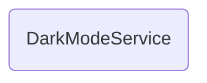

# DarkModeService

## Descripción
Servicio `providedIn: 'root'` que gestiona el tema oscuro/claro de la aplicación. Incluye:
- Signal `isDark` reactiva para el estado del tema
- Persistencia en `localStorage` bajo la clave `'darkMode'`
- Detección de preferencia del sistema (`prefers-color-scheme: dark`)
- Toggle de clase `dark` en `<html>` mediante `document.documentElement.classList`

## API / Interfaz pública

### Propiedades
| Propiedad | Tipo | Descripción |
|-----------|------|-------------|
| `isDark` | `Signal<boolean>` | Indica si el modo oscuro está activo |

### Métodos públicos
| Método | Descripción |
|--------|-------------|
| `toggle()` | Alterna entre modo oscuro/claro y persiste |

## Grafo de dependencias

| Métrica | Valor |
|---------|-------|
| Fan-out | 0 |
| Fan-in | 2 |

### Dependencias
Ninguna (sin imports relativos)

### Dependientes (importado por)
| Nota | Archivo |
|------|---------|
| [[comp-001]] | src/app/app.ts |
| [[comp-002]] | src/app/layout/topbar/topbar.ts |

## Zettelkasten

| Campo | Valor |
|-------|-------|
| ID | `serv-002` |
| Autor | @lancast |
| Creado | 2026-06-10 |
| Tags | angular, service, dark-mode, theme, localStorage |

### Enlaces salientes
Ninguno

### Enlaces entrantes
- [[comp-001]] → App lo instancia al bootstrappear
- [[comp-002]] → Topbar expone el toggle de modo oscuro

## Changelog
| Fecha | Autor | Cambio |
|-------|-------|--------|
| 2026-06-10 | @lancast | creación del servicio DarkModeService |
