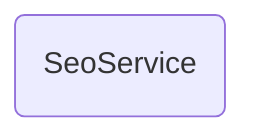

# SeoService

## Descripción
Servicio `providedIn: 'root'` que genera y actualiza dinámicamente las etiquetas meta para optimización SEO/AEO y social sharing. Incluye:
- Actualización del `<title>` del documento
- Meta tag `description`
- Open Graph tags (`og:title`, `og:description`, `og:image`, `og:url`, `og:type`)
- Twitter Card tags (`twitter:card`, `twitter:title`, `twitter:description`, `twitter:image`)
- Fallback a imagen default si no se provee `image`

## API / Interfaz pública

### Interfaz `SeoConfig`
| Propiedad | Tipo | Default | Descripción |
|-----------|------|---------|-------------|
| `title` | `string` | — | Título de la página |
| `description` | `string` | — | Descripción meta |
| `image?` | `string` | `'.../Logo1.png'` | URL de imagen OG |
| `url?` | `string` | — | URL canónica OG |

### Métodos públicos
| Método | Descripción |
|--------|-------------|
| `generateTags(config: SeoConfig)` | Genera/actualiza todos los meta tags |

## Grafo de dependencias

| Métrica | Valor |
|---------|-------|
| Fan-out | 0 |
| Fan-in | 2 |

### Dependencias
Ninguna (usa `Title` y `Meta` de `@angular/platform-browser`)

### Dependientes (importado por)
| Nota | Archivo |
|------|---------|
| [[comp-005]] | src/app/pages/transparencia/transparencia.ts |
| [[comp-011]] | src/app/pages/manifiesto/manifiesto.ts |

## Zettelkasten

| Campo | Valor |
|-------|-------|
| ID | `serv-001` |
| Autor | @lancast |
| Creado | 2026-06-10 |
| Tags | angular, service, seo, meta, og, twitter-cards |

### Enlaces salientes
Ninguno

### Enlaces entrantes
- [[comp-005]] → Transparencia genera SEO al cargar
- [[comp-011]] → Manifiesto genera SEO al cargar

## Changelog
| Fecha | Autor | Cambio |
|-------|-------|--------|
| 2026-06-10 | @lancast | creación del servicio SeoService |
