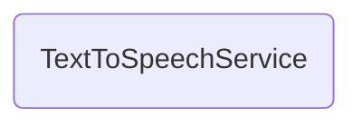

# TextToSpeechService

## Descripción
Servicio `providedIn: 'root'` que provee funcionalidad completa de síntesis de voz (TTS). Incluye:
- División automática de texto en chunks (< 200 caracteres) para estabilidad en móviles
- Filtrado de voces españolas (es-MX, es-ES, es)
- Selección dinámica de voz y velocidad (0.5 a 3.0)
- Control de reproducción: `speak()`, `pause()`, `resume()`, `stop()`
- Signals reactivas: `isPlaying`, `isPaused`, `currentText`, `voices`, `selectedVoice`, `rate`
- Manejo de errores con fallback a voz del sistema
- Auto-stop en `beforeunload`

## API / Interfaz pública

### Propiedades (públicas)
| Propiedad | Tipo | Descripción |
|-----------|------|-------------|
| `isPlaying` | `Signal<boolean>` | Indica si está reproduciendo |
| `isPaused` | `Signal<boolean>` | Indica si está pausado |
| `currentText` | `Signal<string>` | Texto actual en reproducción |
| `voices` | `WritableSignal<SpeechSynthesisVoice[]>` | Lista de voces disponibles |
| `selectedVoice` | `WritableSignal<SpeechSynthesisVoice \| null>` | Voz seleccionada |
| `rate` | `WritableSignal<number>` | Velocidad de lectura (0.5-3.0) |

### Métodos públicos
| Método | Descripción |
|--------|-------------|
| `speak(text: string \| string[])` | Inicia la reproducción del texto |
| `pause()` | Pausa la reproducción |
| `resume()` | Reanuda la reproducción |
| `stop()` | Detiene y limpia el estado |
| `setVoice(voice: SpeechSynthesisVoice)` | Cambia la voz |
| `setRate(speed: number)` | Cambia la velocidad |

## Grafo de dependencias

| Métrica | Valor |
|---------|-------|
| Fan-out | 0 |
| Fan-in | 2 |

### Dependencias
Ninguna (sin imports relativos; usa Web Speech API)

### Dependientes (importado por)
| Nota | Archivo |
|------|---------|
| [[comp-012]] | src/app/shared/audio-reader/audio-reader.ts |
| [[comp-011]] | src/app/pages/manifiesto/manifiesto.ts |

## Zettelkasten

| Campo | Valor |
|-------|-------|
| ID | `serv-003` |
| Autor | @lancast |
| Creado | 2026-06-10 |
| Tags | angular, service, tts, speech, accessibility, audio |

### Enlaces salientes
Ninguno

### Enlaces entrantes
- [[comp-012]] → AudioReader consume el servicio para controles de audio
- [[comp-011]] → Manifiesto lo inyecta para funcionalidad TTS

## Changelog
| Fecha | Autor | Cambio |
|-------|-------|--------|
| 2026-06-10 | @lancast | creación del servicio TextToSpeechService |
